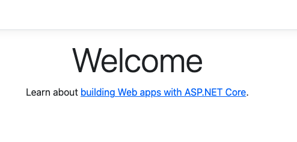

# .NETのコマンドを使用してVSコードでプロジェクトを作成する
Macで`.NET`の開発がしたい<br>
だが visual studio for mac は使いにくい (windows版と色々と仕様が異なる)<br><br>

そこで`dotnet`コマンドと、VSコードで開発することにした<br>
このページはその時のメモ<br>

## dotnetコマンド
MVCプロジェクトを作成
```
dotnet new mvc
```
オプションを指定したプロジェクト作成
```
dotnet new mvc \
    -f net6.0 \   # フレームワークSDL
    -lang "C#" \  # 言語　
    -n Sample     # プロジェクト名
```

ソース コードを実行
```
donet run
```

ビルド
```
donet build
```

コマンドのヘルプページを開く
```
dotnet help <command>
# e.g. dotnet help new
```
<br>

## プロジェクトを作成する
`dotnet new`で実際にプロジェクトを作成する
```
dotnet new mvc \
    -f net6.0 \
    -lang "C#" \
    -n Sample


The template "ASP.NET Core Web App (Model-View-Controller)" was created successfully.
This template contains technologies from parties other than Microsoft, see https://aka.ms/aspnetcore/6.0-third-party-notices for details.

Processing post-creation actions...
Running 'dotnet restore' on /Users/****/project/***/***.csproj...
  Determining projects to restore...
  Restored /Users/***/project/***/***.csproj (in 108 ms).
Restore succeeded.
```
## 実行結果を確認する
`ls`コマンドで作成されたプロジェクトを確認<br>
必要なファイルが全て作成されていた
```
ls

Controllers			Properties			appsettings.Development.json	wwwroot
Models				Views				appsettings.json
Program.cs			Sample.csproj			obj
```

## 実行する
プロジェクト直下（.csprojがあるフォルダ）でソースコードを実行
```
dotnet run


Building...
info: Microsoft.Hosting.Lifetime[14]
      Now listening on: https://localhost:7121
info: Microsoft.Hosting.Lifetime[14]
      Now listening on: http://localhost:5209
info: Microsoft.Hosting.Lifetime[0]
      Application started. Press Ctrl+C to shut down.
info: Microsoft.Hosting.Lifetime[0]
      Hosting environment: Development
info: Microsoft.Hosting.Lifetime[0]
      Content root path: /Users/****/project/***/***
```

`https://localhost:[ポート番号]`のリンクから、実行が確認できた<br>



## Reference
[.NET CLI](https://learn.microsoft.com/ja-jp/dotnet/core/tools/)<br>
[dotnet new テンプレート](https://learn.microsoft.com/ja-jp/dotnet/core/tools/dotnet-new-sdk-templates)<br>
