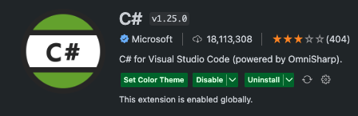
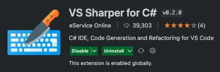
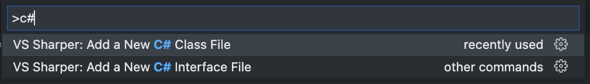

# VSコードで.NETを開発するために必要なもの
必要なものをまとめる

## VSコード拡張
C# for Visual Studio Code<br>
基本のC#拡張<br>
インテリセンス、シンタックスハイライトなど<br>

<br>
<br>

CS Sharper for C#<br>
C#のクラスファイル作成機能<br>
<br>

`⌘ + shift + p`でコマンドパレットを開き、`C#`と入力すると<br>
ファイル作成の選択肢が表示される<br>
<br>
続けてクラス名を入力すると、csファイルがC#形式で作成される<br>

```C#
using System;

namespace Sample
{
    public class FetchService
    {

    }
}
```

## Reference
[dotnet GitHub](https://github.com/dotnet)<br>
