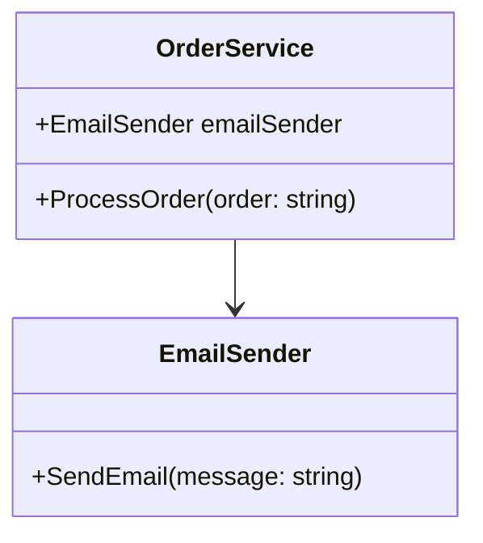
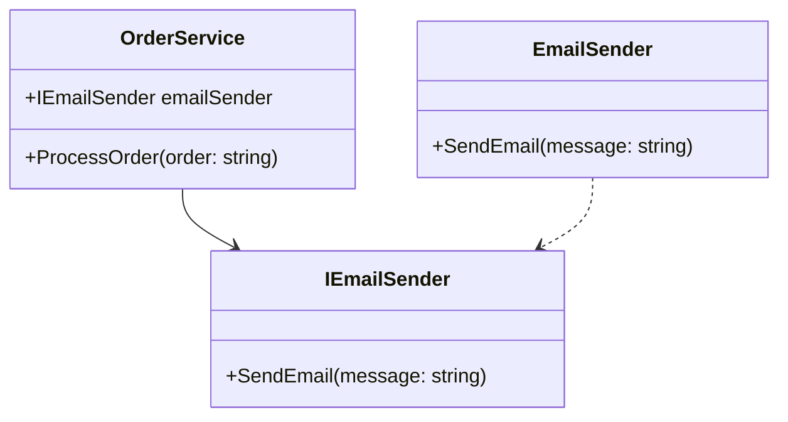
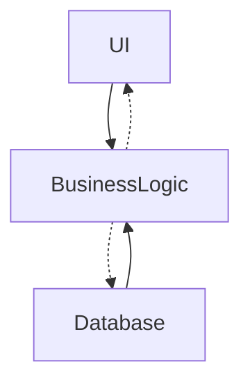

---
tags:
  - ブログ
  - クリーンアーキテクチャ
---

# クリーンアーキテクチャについて

クリーンアーキテクチャについて調べたことをまとめる場所

## 設計とアーキテクチャ

ソフトウェアアーキテクチャの目的は、 
「求められるシステムを構築・保守するために必要な人材を最小限に抑えること」である

→ 設計が優れていれば、リリースに必要な労力が少なくて済む

クリーンなコードでなければ、生産性は急激に低下していく

→ 崩壊したコードを書くほうがクリーンなコードを書くよりも常に遅い

速く進む唯一の方法は、うまく進むことである

## 2つの価値のお話

開発者は、以下の2つの価値を提供する
- 振る舞い
- 構造

「振る舞いよりも、構造の方が重要である」

ソフトウェアの構造
- ソフトウェアは、簡単に変更できなければいけない
- 変更の難易度は、変更のスコープに比例しなければいけない

ビジネスマネージャーはアーキテクチャの重要性を評価できないので、アーキテクト、開発チームが闘う必要がある

## パラダイムの概要

3つのパラダイム
- 構造化プログラミング : 直接的な制御の移行に規律を課すもの
- オブジェクト指向プログラミング : 関節的な制御の移行に規律を課すもの
- 関数型プログラミング : 代入に規律を課すもの

規律とは？

→「何をすべきでないか」を考えることが重要

アーキテクチャの3つの大きな関心事
- コンポーネントの分離
- データ管理
- 機能

## 構造化プログラミング

「goto文は有害である」

構造化プログラミングは、モジュールを機能的に分割できる

大きな問題は、小さな問題に分割できる → 「分割統治法」

→ 大きな問題をモジュールやコンポーネントに分割し、さらに証明可能な機能へと分割していった

「テストはバグが存在しないことではなく、バグが存在することを示すものである」

→ テストはプログラムが正しくないことは証明できるが、プログラムが正しいことは証明できない

アーキテクチャレベルにおいて、**機能分割**がベストプラクティスであり、 
証明可能な小さな機能が正しくないことを証明できない場合、その機能は十分に正しいとみなせる

## オブジェクト指向プログラミング

優れたアーキテクチャの基本となるのは「オブジェクト指向設計」

ポリモーフィズムを使用することで、システムにあるすべてのソースコードの依存関係を絶対的に制御する能力

### ポリモーフィズムのメリット

プラグインアーキテクチャを実現できる 
→ 呼び出し元は、呼び出し先の詳細を知らなくても使用することができる

### 依存関係逆転

NG：高レベルのモジュール `OrderService` があり、それが低レベルのモジュール `EmailSender` に依存

 

OK：`OrderService` は `IEmailSender` インターフェースに依存するように変更  
制御の流れと依存関係が逆転され、「依存関係逆転の原則」が適用できている状態

 
 

ソフトウェアアーキテクトは、ビジネスロジックが画面やDBに依存しないようにポリモーフィズムを使って依存関係をコントロールできる

ビジネスロジックだけを独立させデプロイすることも可能となる（画面、データベースの変更に影響を受けない）
 

ポリモーフィズムがオブジェクト指向プログラミングの要 
→ 上位レベルの方針を含んだモジュールを、下位レベルの詳細を含んだモジュールから独立させることができる

## Reference
- [The Clean Architecture](https://blog.cleancoder.com/uncle-bob/2012/08/13/the-clean-architecture.html)
- [実装クリーンアーキテクチャ](https://qiita.com/nrslib/items/a5f902c4defc83bd46b8)