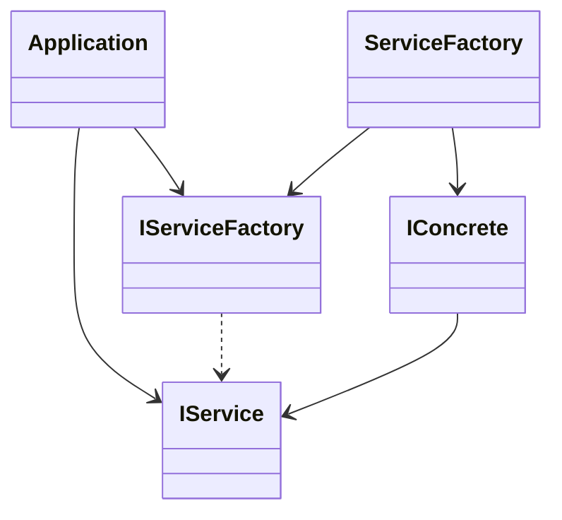
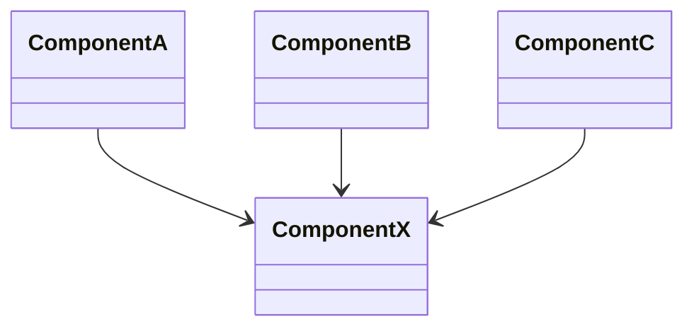
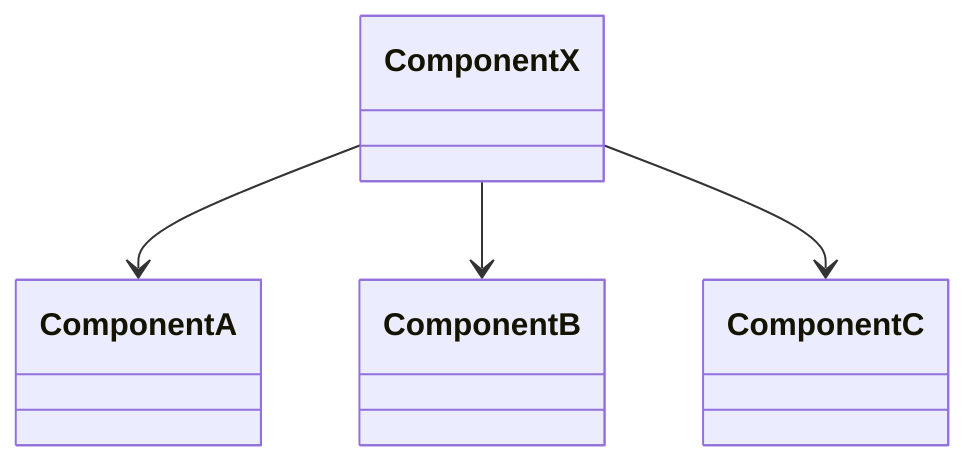

---
tags:
  - ブログ
  - クリーンアーキテクチャ
---

# クリーンアーキテクチャについて

クリーンアーキテクチャについて調べたことをまとめる場所

## 設計とアーキテクチャ

ソフトウェアアーキテクチャの目的は、 
「求められるシステムを構築・保守するために必要な人材を最小限に抑えること」である

→ 設計が優れていれば、リリースに必要な労力が少なくて済む

クリーンなコードでなければ、生産性は急激に低下していく

→ 崩壊したコードを書くほうがクリーンなコードを書くよりも常に遅い

速く進む唯一の方法は、うまく進むことである

## 2つの価値のお話

開発者は、以下の2つの価値を提供する
- 振る舞い
- 構造

「振る舞いよりも、構造の方が重要である」

ソフトウェアの構造
- ソフトウェアは、簡単に変更できなければいけない
- 変更の難易度は、変更のスコープに比例しなければいけない

ビジネスマネージャーはアーキテクチャの重要性を評価できないので、アーキテクト、開発チームが闘う必要がある

## パラダイムの概要

3つのパラダイム
- 構造化プログラミング : 直接的な制御の移行に規律を課すもの
- オブジェクト指向プログラミング : 関節的な制御の移行に規律を課すもの
- 関数型プログラミング : 代入に規律を課すもの

規律とは？

→「何をすべきでないか」を考えることが重要

アーキテクチャの3つの大きな関心事
- コンポーネントの分離
- データ管理
- 機能

## 構造化プログラミング

「goto文は有害である」

構造化プログラミングは、モジュールを機能的に分割できる

大きな問題は、小さな問題に分割できる → 「分割統治法」

→ 大きな問題をモジュールやコンポーネントに分割し、さらに証明可能な機能へと分割していった

「テストはバグが存在しないことではなく、バグが存在することを示すものである」

→ テストはプログラムが正しくないことは証明できるが、プログラムが正しいことは証明できない

アーキテクチャレベルにおいて、**機能分割**がベストプラクティスであり、 
証明可能な小さな機能が正しくないことを証明できない場合、その機能は十分に正しいとみなせる

## オブジェクト指向プログラミング

優れたアーキテクチャの基本となるのは「オブジェクト指向設計」

ポリモーフィズムを使用することで、システムにあるすべてのソースコードの依存関係を絶対的に制御する能力

### ポリモーフィズムのメリット

プラグインアーキテクチャを実現できる 
→ 呼び出し元は、呼び出し先の詳細を知らなくても使用することができる

### 依存関係逆転

NG：高レベルのモジュール `OrderService` があり、それが低レベルのモジュール `EmailSender` に依存

 

OK：`OrderService` は `IEmailSender` インターフェースに依存するように変更  
制御の流れと依存関係が逆転され、「依存関係逆転の原則」が適用できている状態

 
 

ソフトウェアアーキテクトは、ビジネスロジックが画面やDBに依存しないようにポリモーフィズムを使って依存関係をコントロールできる

ビジネスロジックだけを独立させデプロイすることも可能となる（画面、データベースの変更に影響を受けない）
 

ポリモーフィズムがオブジェクト指向プログラミングの要 
→ 上位レベルの方針を含んだモジュールを、下位レベルの詳細を含んだモジュールから独立させることができる

## 関数型プログラミング

「関数型言語の変数は変化しない」→　代入などによって状態が変更されない（不変性）

可変性の分離 → 可変コンポーネントと不変コンポーネントに分離する

適切に構造化されたアプリケーションは、変数を変更しないコンポーネントと変更するコンポーネントに分離されている

「不変コンポーネントにできるだけ多くの処理を押し込み、可変コンポーネントからできるだけ多くのコードを追い払うべき」

### イベントソーシング
→ 状態ではなく取引（トランザクション）を保存する戦略 
（例：銀行残高の状態を保存するのではなく、銀行取引の履歴から現在の残高を計算する）

- 状態レス：  システムの状態は明示的に保持されず、過去のイベントの履歴から導き出される
- 再帰可能性：過去のイベントをすべて再生することで、システムの状態を任意の時点に復元することができる
- 監査追跡：  過去のイベントをすべて保持することで、システムの変更履歴を詳細に追跡することができまる
- 柔軟性：    変化するビジネス要件に柔軟に対応しやすく、システムを拡張しやすいという利点がある

## 設計の原則

SOLID原則の目的は、以下のような性質を持つ**中間レベルの**ソフトウェア構造を作ること
- 変更に強いこと
- 理解しやすいこと
- コンポーネントの基盤として、多くのソフトウェアシステムで利用できること

※SOLID原則は、モジュールやコンポーネントで使うソフトウェア構造の定義に役立つ

- 単一責任の原則
- オープン・クローズドの原則
- リスコフの置換原則
- インターフェイス分離の原則
- 依存関係逆転の原則

### SRP: 単一責任の原則

「モジュールを変更する理由は、たったひとつだけであるべきである」 
↓ 
「モジュールはたったひとりのユーザーやステークホルダーに対して責務を負うべきである」 
↓ 
「モジュールはたったひとつのアクターに対して責務を負うべきである」

※アクターとは 
複数のユーザーやステークホルダー等、システムを同じように変更したいと考える人たちをグループとして扱ったもの

※モジュールとは 
ソースファイル、またはいくつかの関数やデータをまとめた凝集性のあるもの

### NG例と発生する問題
NG：単一責任の原則（SRP）に違反している例

`Employee`クラスは

- 経理部門が扱う `CalculatePay()`
- 人事部門が扱う `ReportHours()`
- データベース管理者が扱う `Save()`

など複数のアクターに対して責務を負っている状態

異なるアクターに対して利用するコードは、共通化すべきではない 
→ アクター事の要望によって変更が生じ、想定外の影響範囲の拡大やコンフリクトが発生する

### 解決策

ファサードパターン

クラスを扱う窓口（複数の処理を束ねた関数・メソッド）を用意するイメージ

一連の決まった処理をラップした関数（ファサード）を作る等

メリット
- 呼び出し側に制御を記載しないのでバグが減る
- 窓口を設けることで外部と疎結合になる

単一責任の原則（SRP）は
- コンポーネントレベルでは、「閉鎖性共通の原則（CCP）」と呼ばれる
- アーキテクチャレベルでは「アーキテクチャの境界」を作るための「変更の軸」と呼ばれる

### OCP: オープン・クローズドの原則

「ソフトウェアの構成要素は拡張に対しては開いてて、修正に閉じていなければいけない」

→ 既存の成果物を変更せずに拡張できるようにすべき

上位レベルにあるコンポーネントは、下位レベルのコンポーネントが変更されたとしても変更する必要がない設計にする

上位レベル ---> 下位レベル 
Business Logic -> Controller -> Presenter -> View

- 方向の制御 : インターフェイスを用いて依存関係を逆転させ、方向を制御する
- 情報隠蔽 : インターフェイスを用いてエンティティ自身が使っていないものに依存しないように内部を隠蔽する

変更の影響を受けずにシステムを拡張しやすくすることが目的
- システムをコンポーネントに分割し、コンポーネントの依存関係を階層構造にする
- 上位レベルのコンポーネントが下位レベルのコンポーネントの影響を受けないようにする

### LSP: リスコフの置換原則

インターフェイスと実装に関するソフトウェア設計の原則

`Bulling`は、使っている2つの派生型に依存せず、リスコフの置換原則を満たす設計になっている 
2つの派生型は、どちらも`License`型に置き換えることができる

クラスのインターフェイスでも、RESTのURIによるインターフェイスでも様々なところで適用できる原則 
置換可能性に少しでも違反すると、複雑になる（if文、不具合の増加）

### ISP: インターフェイス分離の原則

NG：User1クラスは、実際には使っていないop2・op2に意図せず依存している 
（使用しているクラスに再コンパイル・再デプロイが発生する）

OK：インターフェイスに分離すれば、User1の再コンパイル・再デプロイは不要になる

必要としないお荷物を抱えたものに依存していると、予期せぬトラブルの元につながる 
「分離せよ」

### DIP: 依存関係逆転の原則

「ソースコードの依存関係が（具象ではなく）抽象だけを参照しているもの。それが最も柔軟なシステムである」

JavaやC#などの静的型付け言語なら、参照先をインターフェイスや具象クラスなどに限定する

→ システム内の**変化しやすい**具象要素には依存させない（特に下位レベルのコンポーネント）

コーディングレベルのプラクティス
- 変化しやすい具象クラスを参照しない: 代わりにインターフェイスを参照する、Abstract Factory パターン
- 変化しやすい具象クラスを継承しない: 継承は一種の依存関係のため気を付けて使う
- 具象関数をオーバーライドしない: 依存をうまく管理するうには、元の関数を抽象関数にして、それに対する複数の実装を用意する
- 変化しやすい具象を名指しで参照しない

Abstract Factory パターンによる実装

## コンポーネントの原則

### コンポーネント
コンポーネントとは、デプロイ単位のこと（システムの一部としてデプロイできる最小限のまとまり）
→ .NET ならdll

動的にリンクされたファイルを実行時にプラグインできるもの

### コンポーネントの凝集性

#### 再利用・リリース等価の原則（REP）

「再利用の単位とリリースの単位は等価になる」

コンポーネントを形成するクラスやモジュールは、凝集性のあるグループでなければいけない 
- コンポーネントは一貫するテーマや目的があり、それを共有するモジュールで構成されるべき
- コンポーネントを形成するクラスやモジュールはまとめてリリース可能でなければいけない

#### 閉鎖性共通の原則（CCP）

「同じ理由、同じタイミングで変更されるクラスをコンポーネントにまとめること」

「変更の理由やタイミングがことなるクラスは、別のコンポーネントに分けること」

→ 単一責任の原則（SRP）をコンポーネントレベルで適用したもの

変更する際、ひとつのコンポーネントに変更箇所がまとまっているほうが修正が容易になる

「変更の種類が似ているクラスをひとつのコンポーネントにまとめる」

#### 全再利用の原則（CRP）

「コンポーネントのユーザーに対して、実際に使わないものへの依存を強要してはいけない」

依存関係のない、不要なクラスは同じコンポーネントに含めるべきではない 
→ インターフェイス分離の原則（ISP）をコンポーネントレベルで適用したもの

「不要なものには依存しないこと」

### コンポーネントの結合

#### 非循環依存関係の原則（ADP）

「コンポーネント間の依存関係は、循環してはいけない」

同じソースコードを異なる理由で複数の開発者が変更を加える 
→ ビルド時のマージで問題が発生する可能性がある

開発環境をリリース可能なコンポーネントに分割し、コンポーネントを作業単位とすることで解決する

コンポーネントの依存構造は、有向グラフ構造

有効非循環グラフ（どのコンポーネントからスタートしても矢印をたどって元のコンポーネントに戻らない）

循環構造を解消するには、依存関係逆転の原則に基づいてインターフェイス等を使って矢印の方向を変える

最初から依存構造を作ることは難しく、システムの論理設計に合わせて徐々に修正していく

#### 安定依存関係の原則（SDP）

「安定度の高い方向に依存すること」

3つのコンポーネントがXに依存している場合、Xを変更しない理由が3つあると言える

反対に、XがA,B,Cに依存している場合、それぞれの依存先の変更がXに影響を与えるため不安定となる

「ファン・イン」と「ファン・アウト」のバランスを取ることが重要

すべてのコンポーネントに高い安定度を求める必要はない

安定度の低いコンポーネントを図の上に書くと決めて、上向きの矢印は安定依存の原則に違反していることをすぐに見つけられるようにしておく

抽象コンポーネント（インターフェイスしかないコンポーネント）をうまく使う 
→ 安定度が非常に高く、安定度の低いコンポーネントが依存する対象として適している

#### 安定度・抽象度等価の原則（SAP）

「コンポーネントの抽象度は、その安定度と同程度でなければいけない」

- 安定度の高いコンポーネントは抽象度も高くあるべきで、安定度の高さが拡張の妨げになってはいけない
- 安定度の低いコンポーネントは具体的なものであるべきで、安定度が低いことによって具体的なコードの変更が容易になる

安定度を高くするなら、インターフェイスと抽象クラスで構成すべき => 抽象度が高くなる方向に依存の向きを設計する

## アーキテクチャ

ソフトウェアシステムのアーキテクチャ => それを構築した人がシステムに与えた「形状」
- コンポーネントへの分割、配置
- コンポーネントが相互に通信できるように設計

形状の目的は、そこに含まれるソフトウェアシステムの「開発・デプロイ・運用・保守」を容易にすること 
→ それらを容易にするための戦略は、できるだけ長い期間、できるだけ多く選択肢を残すこと

アーキテクチャの主な目的は、システムのライフサイクルをサポートすること 
→ システムのライフタイムコストを最小限に抑え、プログラマの生産性を最大にすること

## 独立性

アーキテクチャがサポートするもの
- システムのユースケース
- システムの運用：運用のニーズの変化に合わせて移行できるように選択肢を残しておく
- システムの開発：コンウェイの法則（システムは組織の形になる）
- システムのデプロイ：目指すべきは即時デプロイ

「選択肢を残しておく」

「ユースケースによる切り離し」：例）注文の追加のUIと、注文の削除はUIはユースケースが異なるので切り離す 
→ 現状、実務でのWinFormsによる実装では一つの画面を触る際に画面全体に影響してしまう（ReactやBlazor等であれば実現できる）

サービス同士を切り離すとそれぞれが通信する必要がある、また切り離し方式にも選択肢を残しておく

画面構成、アルゴリズム、DBクエリ等が似ているが、ユースケースが違えば重複ではない（共通化しない）

## バウンダリー：境界線を引く

境界線を引く→ソフトウェアの要素を分離し、お互いのことが分からないように制限する

アーキテクトの目的は求められるシステムを構築・維持するために必要な人材を最小限に抑えることだが、「早すぎる決定」と「結合」はそれを阻害する

NG: 早すぎる決定（ビジネス要件（ユースケース）と関係のない決定
- フレームワーク
- データベース
- ウェブサーバー
- ユーティリティライブラリ
- DI

システムをプラグインアーキテクチャにしておくと、変更の影響が伝播しない

## Reference
- [The Clean Architecture](https://blog.cleancoder.com/uncle-bob/2012/08/13/the-clean-architecture.html)
- [実装クリーンアーキテクチャ](https://qiita.com/nrslib/items/a5f902c4defc83bd46b8)