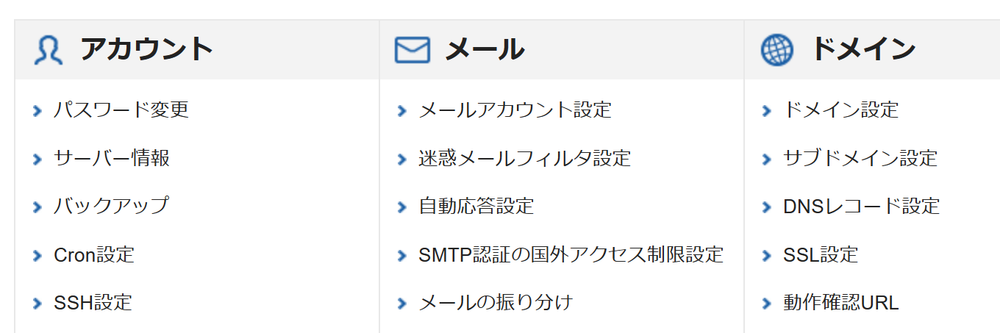
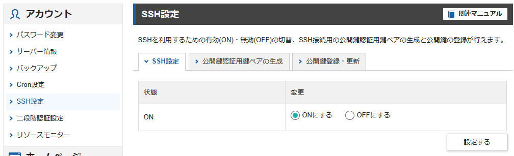
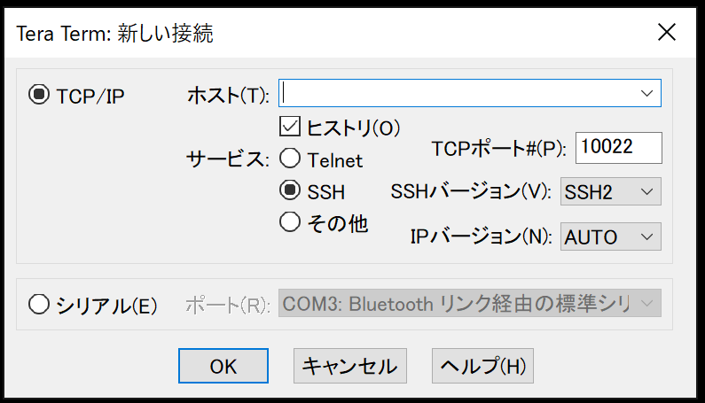

---
tags:
  - ブログ
  - デプロイ
  - ASP.NET
  - Linux
  - CentOS
---

# LinuxサーバーにASP.NET Coreアプリをデプロイする

現在、XServerにWordPressブログを作成している

本記事では、サブドメインを切ってASP.NET Core Webアプリケーションをデプロイする

記事中で取り扱うトピック
- Linux
- CentOS
- .NET Core

## サブドメインを作成
まずXServerの管理画面にログインして、サーバーパネルからサブドメイン設定を開く



[サブドメイン設定追加]でサブドメインを入力し、設定する（※反映まで少し時間がかかる）

## SSH接続でログイン
次にサブドメインのフォルダにSSH接続でログインする

事前に[SSH設定](https://www.xserver.ne.jp/manual/man_server_ssh.php)を行う<br />
サーバーID、公開鍵認証用鍵ペアの生成に使用したパスフレーズが必要となる為、控えておく



ログインには`Tera Term`を使用する（インストールは[プロジェクトページ](https://teratermproject.github.io/)から）

`Tera Term`の接続方法は、[公式ドキュメント](https://www.xserver.ne.jp/manual/man_server_ssh_connect_tera.php)が詳しいので割愛<br />



ログインに成功すると、以下のようにターミナル（黒い画面）が表示される

```bash
Last login: Fri May 17 09:46:32 2024 from as001180.dynamic.ppp.asahi-net.or.jp
[xs77326@sv14626 ~]$
```

シェルを確認
```bash
$ echo $SHELL
/bin/bash
```

`cat /etc/os-release`コマンドで、Linuxのバージョン情報を確認
```bash
$ cat /etc/os-release

NAME="CentOS Linux"
VERSION="7 (Core)"
ID="centos"
ID_LIKE="rhel fedora"
VERSION_ID="7"
PRETTY_NAME="CentOS Linux 7 (Core)"
ANSI_COLOR="0;31"
CPE_NAME="cpe:/o:centos:centos:7"
HOME_URL="https://www.centos.org/"
BUG_REPORT_URL="https://bugs.centos.org/"

CENTOS_MANTISBT_PROJECT="CentOS-7"
CENTOS_MANTISBT_PROJECT_VERSION="7"
REDHAT_SUPPORT_PRODUCT="centos"
REDHAT_SUPPORT_PRODUCT_VERSION="7"
```

`CentOS`のバージョン7という事がわかったので、Microsoftの公式ドキュメントを参考に.NETをインストールする<br />
ただ、以下のドキュメントの方法は`su do`が使えるLinuxのみ参考にできる<br />
https://learn.microsoft.com/ja-jp/dotnet/core/install/linux-centos

XServerは共用サーバーなので、`su do`コマンドを実行しても「許可がありません」と表示される<br />
`su -`でスーパーユーザーになれない（パスワードが分からない）ため、権限の問題でこの方法は使えない

## dotnet-install スクリプト
`dotnet-install`であれば、XServerでもインストール可能

インストール用のディレクトリ作成
```bash
$ mkdir -p /opt/dotnet && cd /opt/dotnet
```

`weget`を使用して`dotnet-install.sh`ダウンロード
```bash
$ wget https://dot.net/v1/dotnet-install.sh -O dotnet-install.sh
```

`dotnet-install.sh`スクリプトに実行権限を付与
```bash
$ chmod +x ./dotnet-install.sh
```

最新のLTS SDKをインストールする
```bash
$ ./dotnet-install.sh --version latest
```

`dotnet`コマンドを環境変数に設定する
```bash
$ export DOTNET_ROOT=$HOME/.dotnet
```

```bash
$ export PATH=$PATH:$DOTNET_ROOT:$DOTNET_ROOT/tools
```

この段階で`dotnet`を実行するとエラーとなる
```bash
$ dotnet
dotnet: /lib64/libstdc++.so.6: version `GLIBCXX_3.4.20' not found (required by dotnet)
dotnet: /lib64/libstdc++.so.6: version `GLIBCXX_3.4.21' not found (required by dotnet)
```

これは、dotnetランタイムが必要としているライブラリ`Glibc`のバージョンが古いことが原因で発生している<br />
`Glibc`は、C言語の標準ライブラリ<br />
参考：[Glibc](https://www.weblio.jp/content/Glibc)


現在の`libc`のバージョンを確認
```bash
$ ldd --version
ldd (GNU libc) 2.17
```

バージョン確認は、RPMパッケージマネージャーを使っても調べることができる
```bash
$ rpm -q glibc
glibc-2.17-326.el7_9.x86_64
```

### Glibcのアップデート

作業用ディレクトリ作成
```bash
$ mkdir -p tmp/glibc
```

※工事中
```bash
$ cd tmp/glibc
$ wget --no-check-certificate https://ftp.gnu.org/gnu/glibc/glibc-3.4.21.tar.gz
```


### 補足
Linuxのターミナルでは、`Ctr + c`でのコピーや`Ctr + v`でのペーストが使えない
- コピーには、`Ctrl + Insert`を使用
- ペーストは、`Shift + Insert`を使用

## Reference
- [SSH設定 | レンタルサーバーならエックスサーバー (xserver.ne.jp)](https://www.xserver.ne.jp/manual/man_server_ssh.php)
- [SSHソフトの設定(Tera Term) | レンタルサーバーならエックスサーバー (xserver.ne.jp)](https://www.xserver.ne.jp/manual/man_server_ssh_connect_tera.php)
- [Linux に .NET をインストールする](https://learn.microsoft.com/ja-jp/dotnet/core/install/linux)
- [インストール スクリプトを使用するか、バイナリを抽出して Linux に .NET をインストールする](https://learn.microsoft.com/ja-jp/dotnet/core/install/linux-scripted-manual#scripted-install)
- [dotnet-install スクリプト リファレンス](https://learn.microsoft.com/ja-jp/dotnet/core/tools/dotnet-install-script)