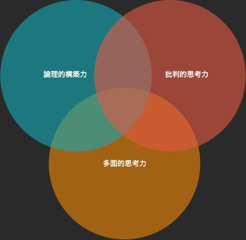

---
tags:
  - ブログ
  - 論理的思考
---

#　ロジカルシンキング

論理的思考（ロジカルシンキング）は、<br>
プログラミング、コミュニケーションなど、様々な場面で必要とされる能力

## ロジカルシンキングにおける3つの思考力

* 論理的構築力
* 批判的思考力
* 多面的思考力



### 1. 論理的構築力
「なぜそうなるのか？」

ロジカルシンキングとは、論理を組み立てて考えること
```
# 論理 == 考え方の道筋

出発点（出発点） -> 経路（根拠）-> 終着点（主張）
```
* つじつまが合っているかどうか
* 論点と主張を結びつける根拠が重要

因果関係をセットで考える問題解決のフレームワーク

「空・雨・傘」

空（事実）-> 雨（解釈） -> 傘（解決策）

### 2. 批判的思考力
「本当にそれは正しいか？」

クリティカルシンキング

- 建設的な批判
- 構築された論理を鵜呑みにしない
- あえて疑いの目で見たり、違う考え方をぶつけることでロジックを磨きあげる

「筋道に歪みや偏りはないか？」<br>
「論理が成り立たない場合はないか？」<br>
「思い込みで判断していないか？」

### 3. 多面的思考力
「他はないか？」

- 網羅できているか
- 欠けている条件はないか
- 他の可能性

## 論理的思考力について
### 分けて考える
複雑な問題も、分けて整理することで全体像がつかみやすくなり、シンプルに考えることができる<br>
分けて単純化することで、抜けていた視点

### ロジカルに道筋を立てるには？

### 1. 論点を設定する
論点は何か？<br>
そもそも何を話したいのか？<br>
どのように論点を設定するかで、導き出す結論が違う

### 2. 構図を把握する
論点の分類

- 記述的問題　正しいか？誤りか？
- 功利的問題　損か？得か？
- 規範的問題　善か？悪か？
- 感情的問題　好きか？嫌いか？

### 論理の道筋を立てるときのパターン
問題は何か？ -> 原因は何か？ -> どんな手が打てるか？ -> 何をすべきか？

### 事実を根拠にする
事実とは、現実に起こったこと・存在すること

- 事実と意見を分ける
- 事実を論理の土台とする

事実に基づいて論理を組み立てる<br>MagicalNuts
事実は可能な限り一次情報が望ましい<br>

- 客観的なデータ（エビデンス）
- アンケート結果
- ファクトデータ、統計

### 仮説を検証する
仮の結論を置く -> 正しいかどうかを事実で裏付けする<br>
仮説が証明できれば、事実として根拠となる<br>
e.g. 刑事の裏付け捜査

### ゼロベースで思考する
仮説思考のデメリットは、仮説に囚われすぎて思考の幅が狭まること<br>
先入観を排除し、まっさらな状態で考えるゼロベース思考も有効

### 背景（コンテキスト）によって意味が変わる
事実や情報は、背景、文脈、関係などのコンテキストが変わると意味が変わることに留意する

### 結論を導き出す
「so what?」 … だから何なの？<br>
何が言いたいのか自分に問いかける<br>

論点（問い）と主張（答え）を一致させる

### 具体的に思考する
- 意味の曖昧な言葉は使わない
- 具体的なイメージを持って考える（チャンクダウン）

who, what, when, where, why, how<br>

具体的な事例や、例えを使って曖昧を具体化する

### 要約する
- 「要するに」を使って圧縮する
- シンプルに考える
- 抽象化する（チャンクアップ）

本質（エッセンス）や、勘所（ポイント）をつかむ要約力を身につける<br>
論点にストレートに答えているところが重要な箇所

### 全体をとらえる
- 全体を大まかにとらえる
- 構造をつかんでから細部に入る

### ゴールから考える
全体をとらえ、ゴールを決めて実行する =>「ゴール思考」

e.g. テストを受けるときの作戦を立てる
1. 問題の全体に目を通す
2. 問題ごとの時間配分を考える
3. どの問題から解くかを決める

### 結論から先に述べる
PREP法
- Point  （結論、主張）    「私の意見は***です」
- Reason  (理由、根拠）    「理由は****です」
- Example (事例、データ）  「たとえば***です」
- Point   (結論、まとめ）  「だから私は***と考えます」

## 批判的思考力について
論理が完成したら、客観的にみて筋が通っているかをチェックする<br>
建設的に批判し、きちんとした道筋で再考して、論理の歪みやほころびを正す<br>

-「根拠は十分か？」
-「Why so?」

「なぜ？」とは、根拠や理由を問いただすフレーズ<br>
根拠が適切でないと、論点と主張が繋がらずロジックが成り立たない<br>

考えることから逃げてはいけない<br>
諦めず、深堀りして考える

### 歪みを正す
法則から現実を導き出す「演繹法（えんえきほう）」<br>

道筋をあまり長くしない

### バランスを正す
現実に起こっていることから、一般的な法則を導く「帰納法（きのうほう）」

```c
A == Y
B == Y
C == Y

A,B,Cの共通点は X

∴ A,B,C == Y
```
サンプルの量が少なければ結論を誤る可能性がある（過度の一般化）

### 因果関係を見極める

すべてのことには原因があると考える

物事に相関があるかどうか

相関があっても、因果関係があるかどうかは別の話

因果関係とは、原因 => 結果 の順番となる事象

隠れた第三の因子の存在がないか？

因果関係があったとして、その関係が重要かどうか

### 前提に疑問を持つ

論理の前提に疑いの目を向ける

「そもそも」

### 反証を探す

正しくないという証拠を見つける

どうしても自分に都合のよい材料ばかりを集めがちになるので、肯定も否定も五分五分で見る習慣をつける

- 「もしそうだとしたら？」
- 「もしそうでないとしたら？」

### 固定観念を打ち破る

「思い込みでは？」

選択的知覚によって、思い込みのフィルターが情報にかかってしまう<br>
（ステレオタイプな見方をしてしまう）

人それぞれの持つ認知や解釈の枠組みによって、偏りや歪みが生じる

無意識に都合のよい情報を選んで集めがち

同じ情報を持ってしても、自分の都合のよいように解釈しがち

### 見込み違いを調べる

バイアスが間違いを生む

* 代表性バイアス (珍しい事例を一般化する)
* 自己奉仕バイアス（自分に都合のよい要因を見つけ出す）
* 利用可能性バイアス（思い出しやすいことを過大評価する）
* 後知恵バイアス（後付けで理屈をつけて正当化する）

偶然に起こったことを因果関係と勘違いする場合にも注意する

## 多面的思考力について

「他はないか？」

多面的な角度から問題を考える力

道は一本とは限らない（横の論理）

### 思考の幅を広げる

できるだけたくさんの「選択肢（オプション）」を考えた上で絞り込む

### 視点を広げる

5Wを変えれば視点が広がる（切り口を変える）

* Who 誰の目で見るか（人、性別、立場、利害関係）
* What 何を見るか（事象、変化、相対、割合、分布）
* Who いつを見るか（過去・未来・現在、季節、期間、時刻、時間）
* Where どこを見るか（地理的な範囲、空間、領域、マクロ・ミクロ、集団の単位）
* Why なぜ見るか（目的、狙い、意図）

### 組み合わせる

発想は既存の組み合わせで生まれる

他に考えが浮かばないのは

1. 持っている情報が少ない
2. 組み合わせ（考えを編集すること）ができていない

という状態

### 似たものからヒントを得る

似たものを見つけて、問題に当てはめる「類推思考・アナロジー思考」

### 制約を外す

役割、権限、ルール、などの制約によって論理に制限が掛かってしまう

「もし...だったら？」（if思考）

と一旦制約を外して考えてみることで視野が広がる

### 両面から見る

分けて整理して考える

「分ける」ことで「分かる」ようになる

2つに分ける
* メリット / デメリット
* 共通点 / 相違点
* 理想 / 現実
* 絶対 / 相対
* 形式 / 実質
* 全体 / 部分
* 効率 / 平等
* 必要 / 願望

二項対立の図式に当てはめてシンプルに考える

ただし、2つしか選択肢がないと思い込まないこと

階層構造で分ける
* 大分類 / 中文類 / 小分類

### ロジカルシンキングのツール

* ロジックツリー
* ピラミッドストラクチャー

### モレ・ダブりをなくす

「モレやダブりはないか？」

MECE（ミーシー）

`Mutually Exclusive and Collective Exhaustive`

### 粒度の違う話を混ぜない

各階層のレベル感（抽象度）を合わせる

### 軸を見つける

マトリクスで分類して整理する
* 重要度、緊急度の大小
* 効果、難易度の大小
* スピード、品質
* イシュー度、解の質

e.g.<br>
アンゾフのマトリクス

### 図で考える

「見える化」することで効果的に整理する

ファシリテーション・グラフィック

### 優先順位を考える

「選択と集中」

重要なものに集中する

問題の本質を探しだす

優先順位を決める基準と価値観

### 考えを統合する

最前の策でなくてもいいと全員が言えるコンセンサスをとる

* 妥協する
* 条件付きで合意する
* 部分的に合意する
* 第三の案で合意する
* プロセスを合意する
