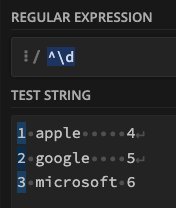
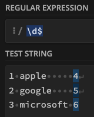
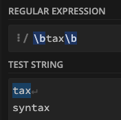
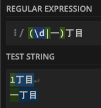
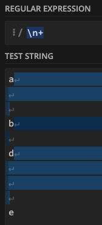
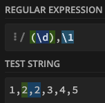
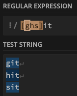
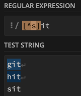
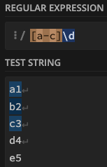

---
tags:
  - 正規表現
  - JavaScirpt
---

# 正規表現

正規表現についてのメモ<br>
正規表現をチェックするサイトについては[こちら](https://pixcelo.github.io/whakamarie/JavaScript/javascript_regex/)でまとめた

本記事における正規表現の検証は[regex101](https://regex101.com/)にて言語`ECMAScript(JavaScript)`を指定して行った

そのため、他言語では結果が異なる場合があるので注意すること

## メタ文字
メタ文字とは正規表現の中で特別な意味を持つ文字や記号<br>
メタ文字自身を指定するときはエスケープ処理をする
```c
. ドット == 改行を除く任意の一文字
```


### 文字種
```c
\d == 0-9
\w == a-z, A-Z, 0-9, _
\s == スペース, タブ、改行

// 大文字 == それぞれの否定になる
\D == \d以外の一文字
\W == \w以外の一文字
\S == \s以外の一文字
```
数値を指定<br>
<br><br>

`a`から始まる文字列を指定<br>
<br><br>

### 量指定子
直前の文字を何回繰り返すかを指定する
```c
{n} == n個
{min, max} == min以上、max以下
{min,} == min以上
```


記号でも`{n}`や`{min,}`などを表現できる
```c
? == {0,1}
+ == {1,}
* == {0,}
```


### アンカー
```c
^  == 行の先頭
$  == 行の末尾
\b \b == 間の単語を指定
```
`^` キャレット（ハット）で先頭の数値を指定<br>


`$` で末尾の数値を指定<br>


`\b \b`で囲んだ単語を指定<br>


### 選択子
どちらかを指定
```c
abc|123  == abc or 123
```


### 改行とタブ
```c
\t         == タブ
\r\n       == 改行(Windows)
\r         == 改行(v9までのmacOS)
\n         == 改行(Unix、v10以降のmacOS)
\r\n|\n|\r == 改行(すべて)
```
1個以上の改行を指定して、replaceメソッドで置換するようなシーンに利用できる



### キャプチャグループ
`()`で囲んだ単語を1つのグループとして記憶する
```c
(\w+) == 1つ以上の単語
```
番号で取り出したり、名前をつけて取り出す（名前付きキャプチャ）ことも可能

### 後方参照
```c
() => \1, \2 と番号で後方の単語にアクセスする
```


### 文字クラス [ ]
`[ ]`で囲んで使用する<br>
```c
[abc]  == a, b, cのどれか一文字を指す
```


```c
[^a] == aの否定（[]の直後しか使えない）
```


```c
[a-b] == a〜bまでの範囲を指定する（文字コード表の順に基づく）
```


- 文字クラス内で`^`、`-`、`]`、`\`を使うときはエスケープが必要
- `^`は`[^`のように最初に使用しない場合は、リテラルとして扱われる
- `[-`のように範囲を指定する対象がない場合は、リテラルとして扱われる

## エスケープ
メタ文字をエスケープして、リテラル(通常の文字)として検索する<br>
バックスラッシュは `option + ¥`
```c
\ バックスラッシュ == 次の文字をエスケープする
```


## Reference
[MDN 正規表現](https://developer.mozilla.org/ja/docs/Web/JavaScript/Guide/Regular_Expressions)<br>
[.NETの正規表現](https://learn.microsoft.com/ja-jp/dotnet/standard/base-types/regular-expressions)<br>
[メタ文字](https://www.php.net/manual/ja/regexp.reference.meta.php)<br>
[文字コード](https://ja.wikipedia.org/wiki/%E6%96%87%E5%AD%97%E3%82%B3%E3%83%BC%E3%83%89)<br>
[グループと範囲 MDN](https://developer.mozilla.org/ja/docs/Web/JavaScript/Guide/Regular_Expressions/Groups_and_Backreferences)<br>
[キャプチャグループ](https://ja.javascript.info/regexp-groups)<br>
[正規表現でのコンストラクトのグループ化](https://learn.microsoft.com/ja-jp/dotnet/standard/base-types/grouping-constructs-in-regular-expressions)<br>
