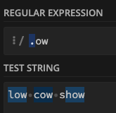
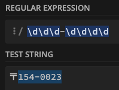
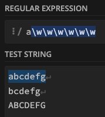
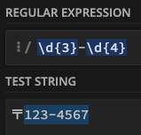
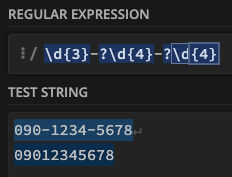
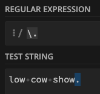

---
tags:
  - 正規表現
---

# 正規表現

正規表現についてのメモ<br>
正規表現をチェックするサイトについては[こちら](https://pixcelo.github.io/whakamarie/JavaScript/javascript_regex/)でまとめた

## メタ文字
```c
. ドット == 改行を除く任意の一文字
```


# 文字種
```c
\d == 0-9
\w == a-z, A-Z, 0-9, _
\s == スペース, タブ、改行

// 大文字 == それぞれの否定になる
\D == \d以外の一文字
\W == \w以外の一文字
\S == \s以外の一文字
```
数値を指定<br>
<br><br>

`a`から始まる文字列を指定<br>
<br><br>

## 量指定子
直前の文字を何回繰り返すかを指定する
```c
{n} == n個
{min, max} == min以上、max以下
{min,} == min以上
```


記号でも`{n}`や`{min,}`などを表現できる
```c
? == {0,1}
+ == {1,}
* == {0,}
```



## エスケープ
メタ文字をエスケープして、リテラルとして検索する<br>
バックスラッシュは `option + ¥`
```c
\ バックスラッシュ == 次の文字をエスケープする
```


## Reference
[MDN 正規表現](https://developer.mozilla.org/ja/docs/Web/JavaScript/Guide/Regular_Expressions)<br>
[.NETの正規表現](https://learn.microsoft.com/ja-jp/dotnet/standard/base-types/regular-expressions)<br>
