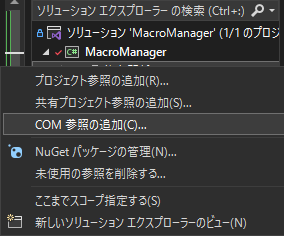
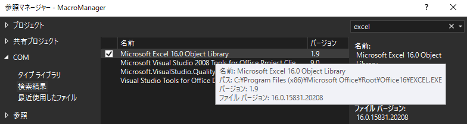

---
tags:
  - C#
---

# C# COM参照を使ってC#でExcelを操作する

Microsoftのアプリケーションは、COM(コンポーネント オブジェクト モデル)という概念で構成されており、小さなプログラムの単位(コンポーネント)に他の環境からアクセスすることができる

「COM参照の追加」から、操作したいアプリケーションへの参照を追加する



Excelを操作する場合、`Microsoft Excel 16.0 Object Library`を参照する



## Usage

 Excelのブックを読み込んで、新しいシートをコピーする

```cs
public void CopySheet(string path)
{
    var excelApp = new Microsoft.Office.Interop.Excel.Application
    {
        Visible = false,
        ScreenUpdating = false
    };

    var workbook = excelApp.Workbooks.Open(path + "\\Test.xlsm");
    var worksheets = workbook.Worksheets;

    worksheets.get_Item("sheet1").Copy(Type.Missing, worksheets[worksheets.Count]);
    worksheets[worksheets.Count].Name = "NEW SHEET";

    workbook.Save();
    workbook.Close();
    excelApp.Quit();
}
```

## Reference
- [コンポーネント オブジェクト モデル (COM)](https://learn.microsoft.com/ja-jp/windows/win32/com/component-object-model--com--portal)
- [相互運用性 (C# プログラミング ガイド)](https://learn.microsoft.com/ja-jp/dotnet/csharp/programming-guide/interop/)
- [Office 相互運用オブジェクトにアクセスする方法 (C# プログラミング ガイド)](https://learn.microsoft.com/ja-jp/dotnet/csharp/programming-guide/interop/how-to-access-office-onterop-objects?source=recommendations)
- [チュートリアル: Office のプログラミング (C# および Visual Basic)](https://learn.microsoft.com/ja-jp/dotnet/csharp/programming-guide/interop/walkthrough-office-programming)
- [Excel オブジェクト モデルの概要](https://learn.microsoft.com/ja-jp/visualstudio/vsto/excel-object-model-overview?redirectedfrom=MSDN&view=vs-2022&tabs=csharp)