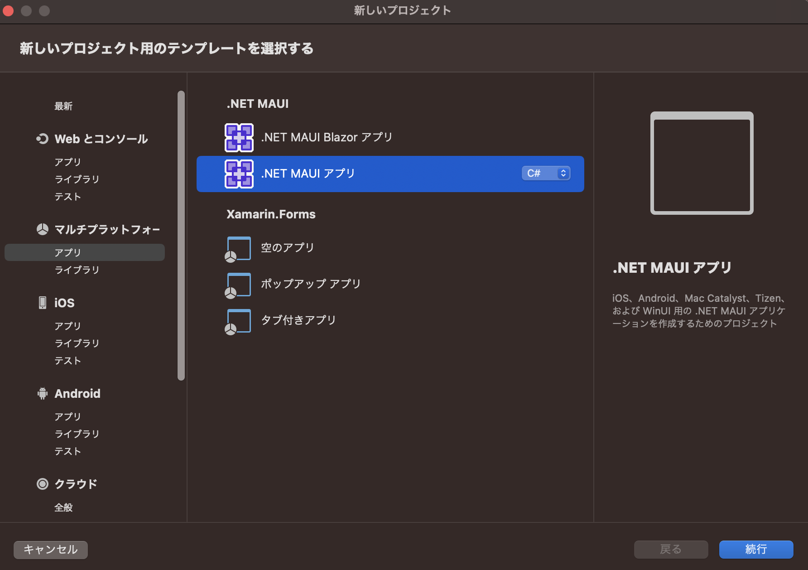
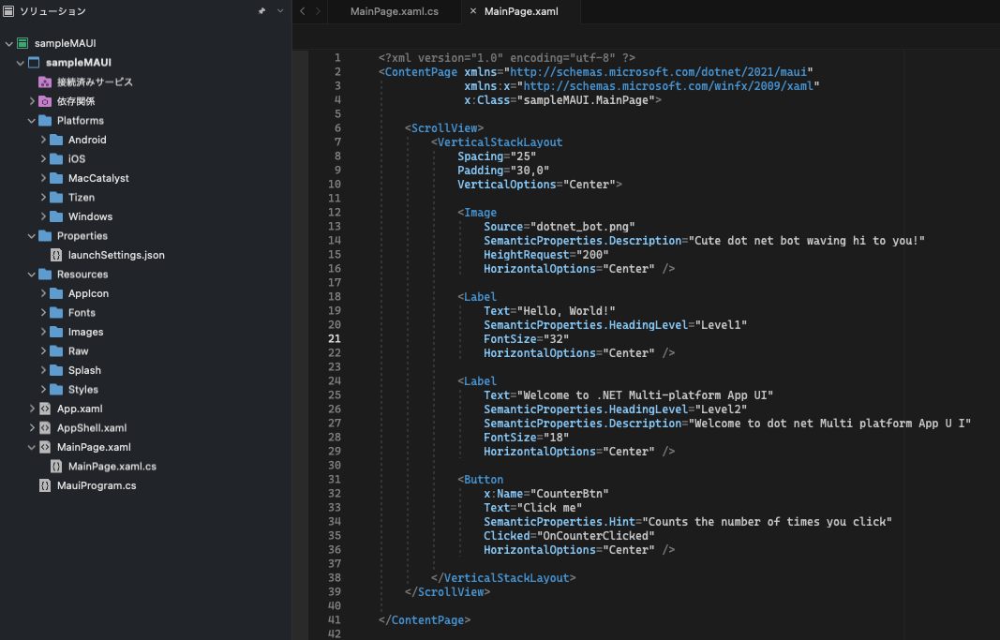
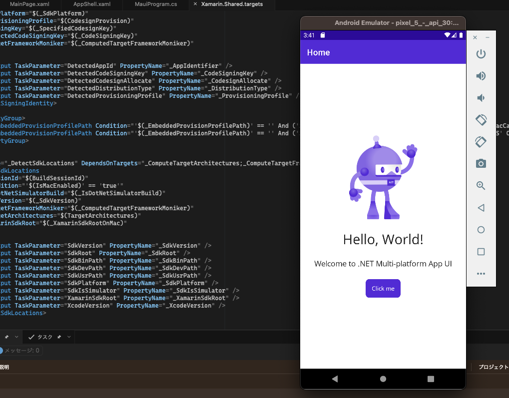

---
tags:
  - C#
  - MAUI
---

# C# Visual Studio for Macで.NET MAUIを使ってGUIアプリケーションを作る

C#でGUIアプリを作る場合、`Winodws Forms`や`WPF`で作るのが一般的だが、Mac版のVisual Studioでは使用できない

今回、`Visual Studio for Mac 17.4`で`.NET MAUI`がリリースされたので作ってみる

## Install

* `Visual Studio 2022 for Mac 17.4 `以降をインストール
* その他、[インストール](https://learn.microsoft.com/ja-jp/dotnet/maui/get-started/installation?tabs=vsmac&view=net-maui-7.0)にあるシステム要件を満たすコンポーネントを追加する

...とあるが、`.NET MAUI`が表示されないので`Visual Studio for Mac Preview`をインストールして起動した

## Usage

新規プロジェクトで`.NET MAUI アプリ`を選択

プロジェクト作成時点の画面

`Platforms`に各プラットフォームの設定ファイルがある

androidでビルドしてみた

iOSでビルドには失敗。apple SDKがないとの事...開発者プログラム（有料）が必要なのか？

## Reference
* [.NET マルチプラットフォーム アプリ UI のドキュメント](https://learn.microsoft.com/ja-jp/dotnet/maui/?view=net-maui-7.0)
* [.NET MAUI とは](https://learn.microsoft.com/ja-jp/dotnet/maui/what-is-maui?view=net-maui-7.0)
