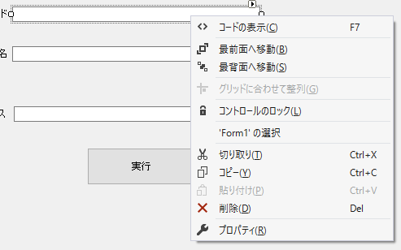
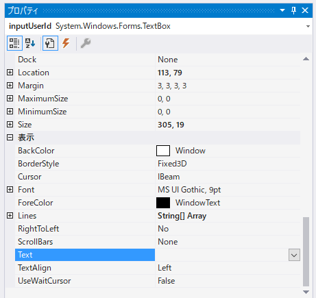

---
tags:
  - C#
  - Windowsフォーム
---

# C# Windowsフォーム テキストボックスに初期値（デフォルト値）を設定する

テキストボックスの初期値（デフォルト値）を設定する方法

## Usage

テキストボックスを右クリックして、プロパティをクリック

`Text`に入力する

## Reference
[Windows フォーム コントロールのプロパティ](https://learn.microsoft.com/ja-jp/dotnet/desktop/winforms/controls/properties-in-windows-forms-controls?view=netframeworkdesktop-4.8)
