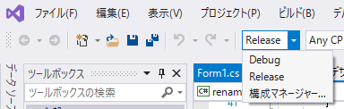
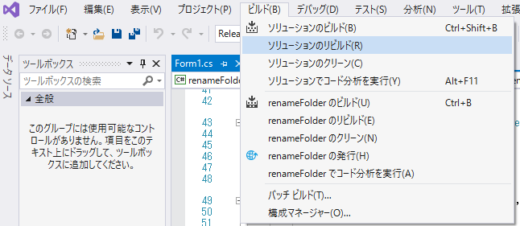
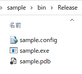

---
tags:
  - C#
  - Windowsフォーム
---

# C# Windowsフォームでexeファイルを作成する（ビルド）

メニューの「Debug」を「Release」に変更する

「ビルド」→「ソリューションのリビルド」をクリック

下部の「出力」に、正常終了のメッセージが表示される

「bin」→「Relaese」フォルダ内に、`exe`を含む各種ファイルが作成される

`.exe`と、`.config`を渡せばOK

## Reference
[デスクトップ ガイド (Windows フォーム .NET)](https://learn.microsoft.com/ja-jp/dotnet/desktop/winforms/overview/?view=netdesktop-6.0) 
