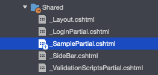

---
tags:
  - C#
  - .NET
---

# C# ASP.NET MVC でページを分割して作成する部分ビュー

ASP.NET MVC でViewページを分割して作成する部分ビューの作り方

## 部分ビュー
部分ビューは、レンダリングするページを細かく分解することができる機能<br>
レイアウト内に共通するマークアップコンテンツの重複を減らす<br>

特に大規模なページになると複雑になることが多く、細かい部分ビューに分割することで管理・保守がしやすくなる<br>

## Usage

`Shared`に`_SamplePartial.cshtml`ファイルを作成



NET MVC 部分ビューのレンダリング

`_SamplePartial.cshtml`内にマークアップ

```C#
<div class="code-title" data-title="_SamplePartial.cshtml">
```html
<p style="color:blue">ここは部分ビューです<p>
```

これを`Privacy.cshtml`から部分ビューを名前で呼び出す

`<partial name="_SamplePartial" />`のように使う

```C#
@{
    ViewData["Title"] = "Privacy Policy";
}
<h1>@ViewData["Title"]</h1>

<p>Use this page to detail your site's privacy policy.</p>

<partial name="_SamplePartial" />
```

部分ビュー（青字の部分）が、別のビューから呼び出されていることが確認できる


部分ビューのレンダリング結果

## Reference
[ASP.NET Core の部分ビュー](https://learn.microsoft.com/ja-jp/aspnet/core/mvc/views/partial?view=aspnetcore-7.0)<br>
[部分ビューを宣言する](https://learn.microsoft.com/ja-jp/aspnet/core/mvc/views/partial?view=aspnetcore-7.0#declare-partial-views)<br>
