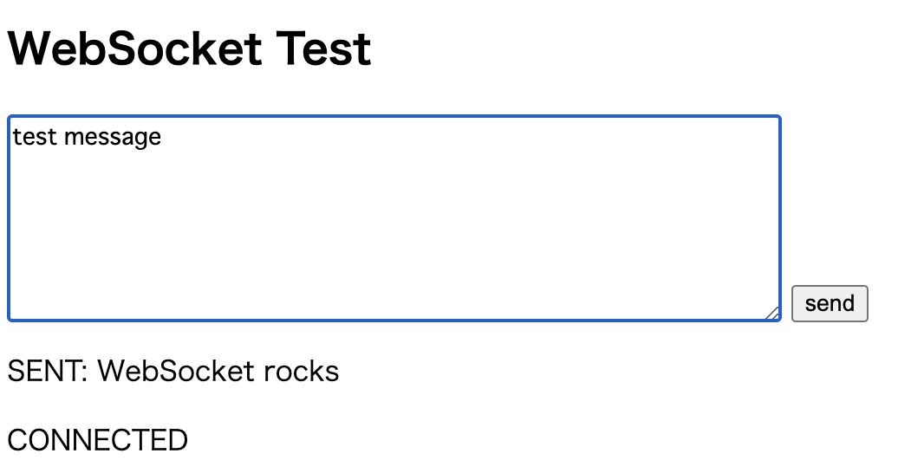
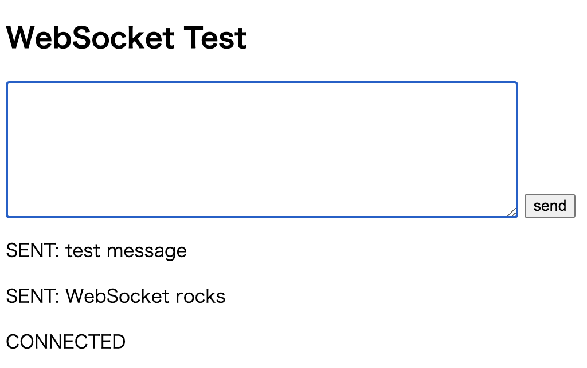

---
tags:
  - C#
---

# C# webSoketサーバーとブラウザの双方向通信

## Topic 

- C#のwebSocketクラスでリアルタイムに通信する
- チュートリアルに沿って動かしてみる

## Environment

開発環境
- Visual Studio Code
- MacOS Ventura 13.1
- .NET 6

## Usage

###  プロジェクト作成
```
dotnet new console
```

### サーバーを作成

- WebSocketはTCPプロトコルにて接続を行う
- `TcpListener`はTCPネットワーク クライアントからの接続をリッスンするクラス

```cs
using System.Net.Sockets;
using System.Net;

class Server
{
    public static void Main()
    {
        var server = new TcpListener(IPAddress.Parse("127.0.0.1"), 13000);

        server.Start();
        Console.WriteLine(
            "Server has started on 127.0.0.1:80.{0}Waiting for a connection...",
            Environment.NewLine);

        TcpClient client = server.AcceptTcpClient();

        Console.WriteLine("A client connected.");
    }
}
```

`Program.cs`は不要なので削除

この状態で`dotnet run`で実行すると例外が発生した

```
Unhandled exception. System.Net.Sockets.SocketException (13): Permission denied
   at System.Net.Sockets.Socket.DoBind(EndPoint endPointSnapshot, SocketAddress socketAddress)
   at System.Net.Sockets.Socket.Bind(EndPoint localEP)
   at System.Net.Sockets.TcpListener.Start(Int32 backlog)
   at Server.Main() in /Users/***/project/csharp/ExampleWebsocket/Server.cs:line 11
```

`server.Start()`で落ちてる

`Permission denied`とあるので、ポート番号を変えて再トライ

```
Server has started on 127.0.0.1:13000.
Waiting for a connection...
```

サーバーが起動できた

## クライアントを作成

TCP接続するクライアントを作成

```html
<!doctype html>
<style>
    textarea { vertical-align: bottom; }
    #output { overflow: auto; }
    #output > p { overflow-wrap: break-word; }
    #output span { color: blue; }
    #output span.error { color: red; }
</style>
<h2>WebSocket Test</h2>
<textarea cols=60 rows=6></textarea>
<button>send</button>
<div id=output></div>
<script>
    // http://www.websocket.org/echo.html

    var button = document.querySelector("button"),
        output = document.querySelector("#output"),
        textarea = document.querySelector("textarea"),
        // wsUri = "ws://echo.websocket.org/",
        wsUri = "ws://127.0.0.1:13000/",
        websocket = new WebSocket(wsUri);

    button.addEventListener("click", onClickButton);

    websocket.onopen = function (e) {
        writeToScreen("CONNECTED");
        doSend("WebSocket rocks");
    };

    websocket.onclose = function (e) {
        writeToScreen("DISCONNECTED");
    };

    websocket.onmessage = function (e) {
        writeToScreen("<span>RESPONSE: " + e.data + "</span>");
    };

    websocket.onerror = function (e) {
        writeToScreen("<span class=error>ERROR:</span> " + e.data);
    };

    function doSend(message) {
        writeToScreen("SENT: " + message);
        websocket.send(message);
    }

    function writeToScreen(message) {
        output.insertAdjacentHTML("afterbegin", "<p>" + message + "</p>");
    }

    function onClickButton() {
        var text = textarea.value;

        text && doSend(text);
        textarea.value = "";
        textarea.focus();
    }
</script>
```



入力欄にテキストを入力して、[send]をクリックすると



websocketサーバー側でメッセージが確認できる

```
Server has started on 127.0.0.1:13000, Waiting for a connection...
A client connected.
=====Handshaking from client=====
GET / HTTP/1.1
Host: 127.0.0.1:13000
Connection: Upgrade
Pragma: no-cache
Cache-Control: no-cache
Upgrade: websocket
Origin: null
Sec-WebSocket-Version: 13
User-Agent: Mozilla/5.0 (Macintosh; Intel Mac OS X 10_15_7) AppleWebKit/537.36 (KHTML, like Gecko) Chrome/108.0.0.0 Safari/537.36
Accept-Encoding: gzip, deflate, br
Accept-Language: ja,en;q=0.9
Sec-GPC: 1
Sec-WebSocket-Key: LQIinwK+MLKnnnTo0PfZMw==
Sec-WebSocket-Extensions: permessage-deflate; client_max_window_bits


WebSocket rocks

test message
```

## Reference
- [C# で WebSocket サーバーを記述する](https://developer.mozilla.org/ja/docs/Web/API/WebSockets_API/Writing_WebSocket_server)
- [TcpListener クラス](https://learn.microsoft.com/ja-jp/dotnet/api/system.net.sockets.tcplistener?view=net-7.0)
- [TcpClient クラス](https://learn.microsoft.com/ja-jp/dotnet/api/system.net.sockets.tcpclient?view=net-7.0)