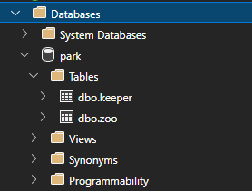
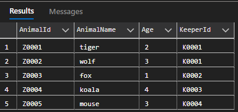
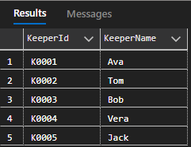
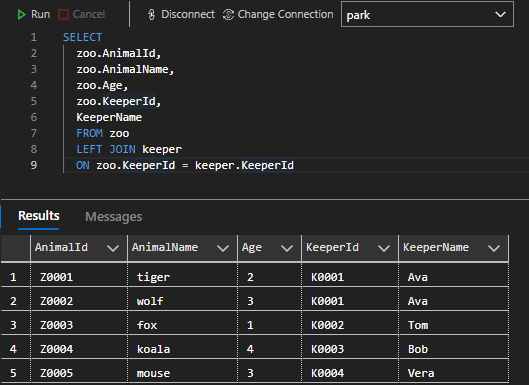

# C# Linqの発行するSQLを確認する

C#における`Linq`は、データベースにアクセスするのにとても便利<br>
Linqで隠蔽されている内部的なSQLの動きについて確認する<br>

## 検証環境のデータベース

データベース`park`に<br>
動物園`zoo`と飼育員`keeper`のテーブルを用意
```sql
USE master;
GO

CREATE DATABASE park;
GO

USE park;
GO

CREATE TABLE zoo (
    AnimalId VARCHAR(5) PRIMARY KEY,
    AnimalName VARCHAR(10) NOT NULL,
    Age INT NULL,
    KeeperId VARCHAR(5)
);
GO

CREATE TABLE keeper (
    KeeperId VARCHAR(5) PRIMARY KEY,
    KeeperName VARCHAR(10) NOT NULL
);
GO

INSERT INTO zoo VALUES ('Z0001', 'tiger', 2, 'K0001');
INSERT INTO zoo VALUES ('Z0002', 'wolf', 3, 'K0001');
INSERT INTO zoo VALUES ('Z0003', 'fox', 1, 'K0002');
INSERT INTO zoo VALUES ('Z0004', 'koala', 4, 'K0003');
INSERT INTO zoo VALUES ('Z0005', 'mouse', 3, 'K0004');
GO

INSERT INTO keeper VALUES ('K0001', 'Ava');
INSERT INTO keeper VALUES ('K0002', 'Tom');
INSERT INTO keeper VALUES ('K0003', 'Bob');
INSERT INTO keeper VALUES ('K0004', 'Vera');
INSERT INTO keeper VALUES ('K0005', 'Jack');
GO
```

作成されたデータベースとテーブルを確認する<br>


テーブルのデータを確認する<br>

<br>


`zoo`テーブルには、飼育員のID`keeperId`をJOIN`で連結することができる<br>


## Linqでデータを呼び出す


## Reference
