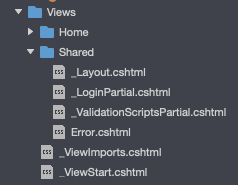
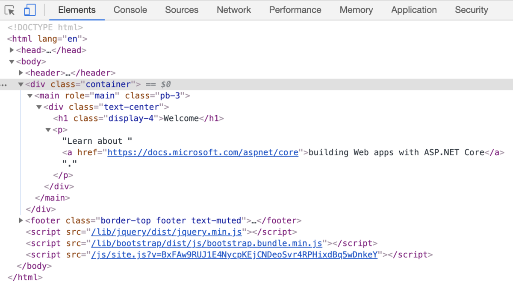

---
tags:
  - C#
  - .NET
---

# ASP.NET MVC のビューで共通レイアウトを編集する

## 共通レイアウト
`javaScript`や`CSS`等、各画面で共通するHTML構造は、共通レイアウト` _Layout.cshtml `として定義する<br>



## Usage
`_Layout.cshtml`は、各ページの共通レイアウトとしてレンダリングされる<br>
内部の`@RenderBody()`部分には、各ページの要素がそれぞれレンダリングされる<br>

```xml
<!DOCTYPE html>
<html lang="en">
<head>
    <meta charset="utf-8" />
    <meta name="viewport" content="width=device-width, initial-scale=1.0" />
    <title>@ViewData["Title"] - Sample</title>
    <link rel="stylesheet" href="~/lib/bootstrap/dist/css/bootstrap.min.css" />
    <link rel="stylesheet" href="~/css/site.css" />
</head>
<body>
    <header>
        <nav class="navbar navbar-expand-sm navbar-toggleable-sm navbar-light bg-white border-bottom box-shadow mb-3">
            <div class="container">
                <a class="navbar-brand" asp-area="" asp-controller="Home" asp-action="Index">samples_hatena</a>
                <button class="navbar-toggler" type="button" data-toggle="collapse" data-target=".navbar-collapse" aria-controls="navbarSupportedContent"
                        aria-expanded="false" aria-label="Toggle navigation">
                    <span class="navbar-toggler-icon"></span>
                </button>
                <div class="navbar-collapse collapse d-sm-inline-flex flex-sm-row-reverse">
                    <partial name="_LoginPartial" />
                    <ul class="navbar-nav flex-grow-1">
                        <li class="nav-item">
                            <a class="nav-link text-dark" asp-area="" asp-controller="Home" asp-action="Index">Home</a>
                        </li>
                        <li class="nav-item">
                            <a class="nav-link text-dark" asp-area="" asp-controller="Home" asp-action="Privacy">Privacy</a>
                        </li>
                    </ul>
                </div>
            </div>
        </nav>
    </header>
    <div class="container">
        <main role="main" class="pb-3">
            @RenderBody()
        </main>
    </div>

    <footer class="border-top footer text-muted">
        <div class="container">
            &copy; 2021 - samples_hatena - <a asp-area="" asp-controller="Home" asp-action="Privacy">Privacy</a>
        </div>
    </footer>
    <script src="~/lib/jquery/dist/jquery.min.js"></script>
    <script src="~/lib/bootstrap/dist/js/bootstrap.bundle.min.js"></script>
    <script src="~/js/site.js" asp-append-version="true"></script>
    @RenderSection("Scripts", required: false)
</body>
</html>
```

`index.cshtml`を次のように定義する

```xml
@{
    ViewData["Title"] = "Home Page";
}

<div class="text-center">
    <h1 class="display-4">Welcome</h1>
    <p>Learn about <a href="https://docs.microsoft.com/aspnet/core">building Web apps with ASP.NET Core</a>.</p>
</div>
```

開発ツールからみると、共通レイアウト`_Layout.cshtml`の`@RenderBody()`部分に`index.html`がレンダリングされている



## Reference
[ASP.NET Core でのレイアウト](https://learn.microsoft.com/ja-jp/aspnet/core/mvc/views/layout?view=aspnetcore-7.0)<br>
