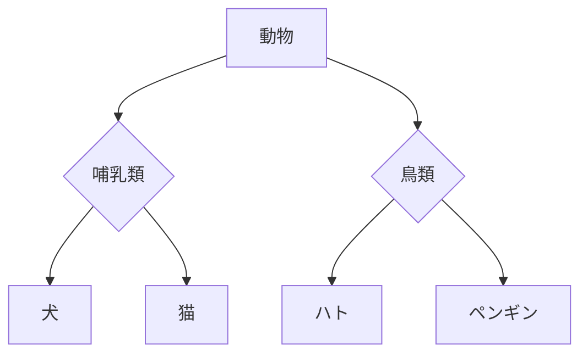

# データベーススペシャリスト試験対策

## 午後Ⅱの問題形式

### 未完成の概念データモデルを完成させる
- エンティティタイプを追加する問題
- リレーションシップを追加する問題

### データベースの設計・実装（物理設計）
- データ所要量を求める計算問題
- テーブル定義表を完成させる問題

## スーパータイプ・サブタイプ
汎化・特化関係を表現したもの

- スーパータイプ: 複数のサブタイプに共通する属性を持つエンティティ。上位階層の概念であり、スーパークラスとも呼ばれる
- サブタイプ: スーパータイプの属性に加え、独自属性を持つエンティティ。下位階層の概念であり、サブクラスとも呼ばれる

**参考**
- [概念データモデルのスーパータイプとサブタイプのパターン](https://taityo-diary.hatenablog.jp/entry/2020/07/21/071553)
- [【データベース設計】スーパータイプ/サブタイプとは何か？](https://qiita.com/tomo0x03a/items/94d8bbac526335fa8ec3)
- [データベースのスーパタイプとサブタイプを理解しよう！](https://itmanabi.com/db-supertype-subtype/)

## 過去問を通じてDBの設計パターンをストックしておく

## 関係スキーマ
関係スキーマとは、関係を関係名とそれを構成する属性名で表したもの

## キーワード
### 関数従属性
ある属性の値が別の属性の値を一意に決定する関係（例：社員ID -> 氏名） 
X -> Y が成り立つとき、Xを決定項、Yを被決定項（従属項）という

- 部分関数従属
- 完全関数従属

### キー
- 主キー
- 候補キー : 主キーの候補となり、複数存在できる
- スーパーキー
- サロゲートキー
- 外部キー

### 正規化
「第〇正規形である根拠を説明させる設問」に回答するために、常套句を暗記しておく必要あり

- 非正規形  : 単一でない値が含まれている
- 第1正規形 : すべての属性が単一値である（繰り返し項目がない状態）
- 第2正規形 : 第1正規形の条件を満たし、すべての非キー属性は、いかなる候補キーにも部分関数従属していない（完全関数従属である）
- 第3正規形
- 第4正規形
- 第5正規形

「部分関数従属する」とは、例えば同一レコード内に「社員コード→社員氏名」などが部分的に成立する状態

### 集合
- 部分集合 : ある集合に対して一部だけ取り出したもの
- 真部分集合 : ある集合に対して一部だけ取り出したもの（全部取り出すは含まない）

## Udemy講義動画
参考になるか？有料でセール時に1800～2000円くらい 
[Udemy 情報処理技術者試験コース](https://www.udemy.com/topic/information-technology-engineers-exam/)

## Reference
- [過去問](https://www.ipa.go.jp/shiken/mondai-kaiotu/index.html)
- [試験情報 データベーススペシャリスト試験](https://www.ipa.go.jp/shiken/kubun/db.html)
- [データベーススペシャリスト試験 動画 ITのプロ46](https://www.youtube.com/watch?v=Muuhtm8vQkY&list=PL53uwBjWE-t4PAa6xdjUZVn-XOQHc6JXn)
- [データベーススペシャリスト2021年板 正誤表](https://www.shoeisha.co.jp/book/detail/9784798167770)