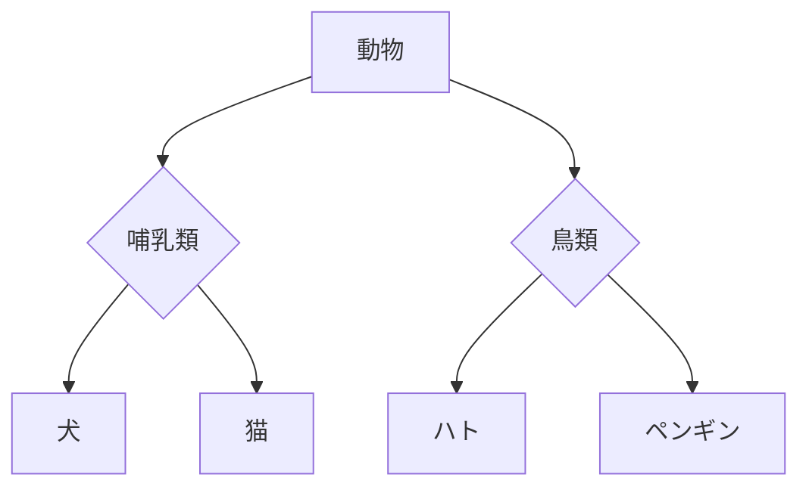

# データベーススペシャリスト試験対策

## 未完成の概念データモデルを完成させる
- エンティティタイプを追加する問題
- リレーションシップを追加する問題

## スーパータイプ・サブタイプ
汎化・特化関係を表現したもの

- スーパータイプ: 複数のサブタイプに共通する属性を持つエンティティ。上位階層の概念であり、スーパークラスとも呼ばれる
- サブタイプ: スーパータイプの属性に加え、独自属性を持つエンティティ。下位階層の概念であり、サブクラスとも呼ばれる

**参考**
- [概念データモデルのスーパータイプとサブタイプのパターン](https://taityo-diary.hatenablog.jp/entry/2020/07/21/071553)
- [【データベース設計】スーパータイプ/サブタイプとは何か？](https://qiita.com/tomo0x03a/items/94d8bbac526335fa8ec3)

## Udemy講義動画
参考になるか？有料でセール時に1800～2000円くらい 
[Udemy 情報処理技術者試験コース](https://www.udemy.com/topic/information-technology-engineers-exam/)

## Reference
- [試験情報 データベーススペシャリスト試験](https://www.ipa.go.jp/shiken/kubun/db.html)
- [データベーススペシャリスト試験 動画 ITのプロ46](https://www.youtube.com/watch?v=Muuhtm8vQkY&list=PL53uwBjWE-t4PAa6xdjUZVn-XOQHc6JXn)
- [データベーススペシャリスト2021年板 正誤表](https://www.shoeisha.co.jp/book/detail/9784798167770)