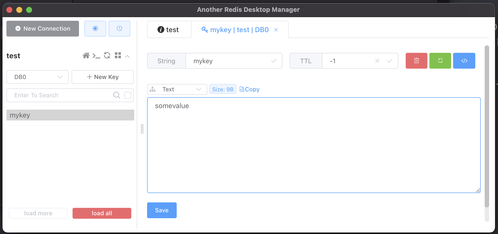

# Redis
インメモリデータベース

- KVS (Key Value Store)
- OSSのメモリデータストア
- 高速

## Install
```
brew install redis
```

インストールに成功後、`redis-server`でRedisのマークが出る
```
redis-server

39094:M 28 Oct 2022 06:26:50.764 * monotonic clock: POSIX clock_gettime
                _._
           _.-``__ ''-._
      _.-``    `.  `_.  ''-._           Redis 7.0.5 (00000000/0) 64 bit
  .-`` .-```.  ```\/    _.,_ ''-._
 (    '      ,       .-`  | `,    )     Running in standalone mode
 |`-._`-...-` __...-.``-._|'` _.-'|     Port: 6379
 |    `-._   `._    /     _.-'    |     PID: 39094
  `-._    `-._  `-./  _.-'    _.-'
 |`-._`-._    `-.__.-'    _.-'_.-'|
 |    `-._`-._        _.-'_.-'    |           https://redis.io
  `-._    `-._`-.__.-'_.-'    _.-'
 |`-._`-._    `-.__.-'    _.-'_.-'|
 |    `-._`-._        _.-'_.-'    |
  `-._    `-._`-.__.-'_.-'    _.-'
      `-._    `-.__.-'    _.-'
          `-._        _.-'
              `-.__.-'

39094:M 28 Oct 2022 06:26:50.765 # WARNING: The TCP backlog setting
```

## データを格納する

- データを入れる `set key value`
- データを取り出す `get key`

```c
redis-cli
redis 127.0.0.1:6379> set mykey somevalue
OK
redis 127.0.0.1:6379> get mykey
"somevalue"
```
- データを消す `del key`
```c
127.0.0.1:6379> del mykey
(integer) 1
127.0.0.1:6379> get mykey
(nil)
```

## GUI Client
[Another Redis Desktop Manager](https://github.com/qishibo/AnotherRedisDesktopManager)<br>
- 無料で使える (MITライセンス)
- クロスプラットフォーム
`Homebrew`でインストール可
```
brew install --cask another-redis-desktop-manager
```
デザインも良い (ダークモードもある)

先ほど`redis-server`で立てたRedisのデータがGUIで確認できた

## 永続化
RDB、 AOFの2種類の永続化の方法を選択、あるいは両方を使用する<br>

### RDB
`save`コマンドでスナップショットをとる
- 900秒後に1個以上のキーが変更
- 300秒後に10個以上のキーが変更
- 60秒後に10000個以上のキーが変更
```
save 900 1
save 300 10
save 60 10000
```
### AOF
書き込みごとに自動的に保存される（その分、データ容量が大きくなる）<br>
AOFはデフォルトはオフなので設定で有効化する
```
appendonly yes
```

## Node.jsでRedisを読み込む
Node.jsで扱うには、`node-redis`をインストールする
```
npm i redis
```

## 各言語のライブラリ
https://redis.io/docs/libraries/

## Reference
[Redis](https://redis.io/)<br>
[Another Redis Desktop Manager](https://github.com/qishibo/AnotherRedisDesktopManager)<br>
