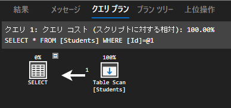
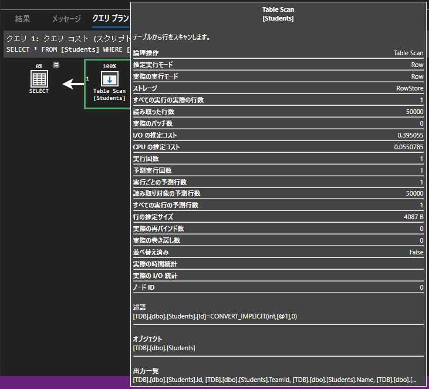
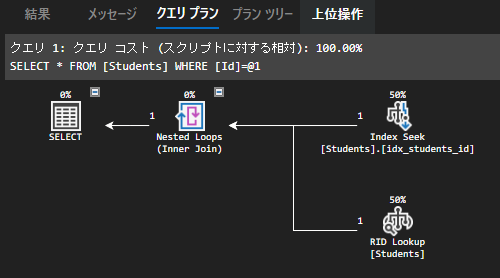
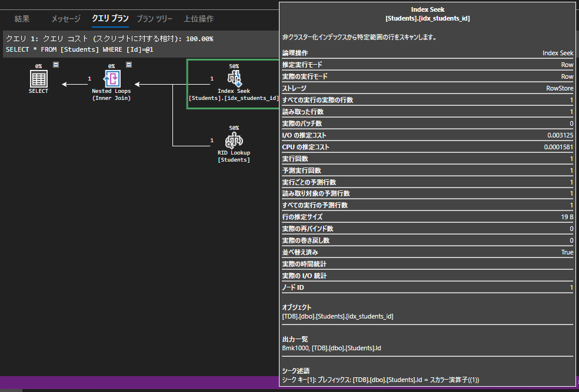
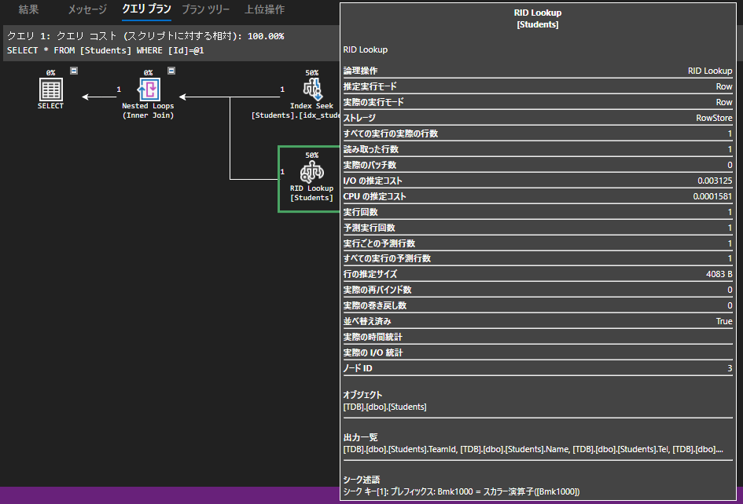
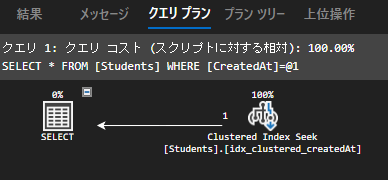
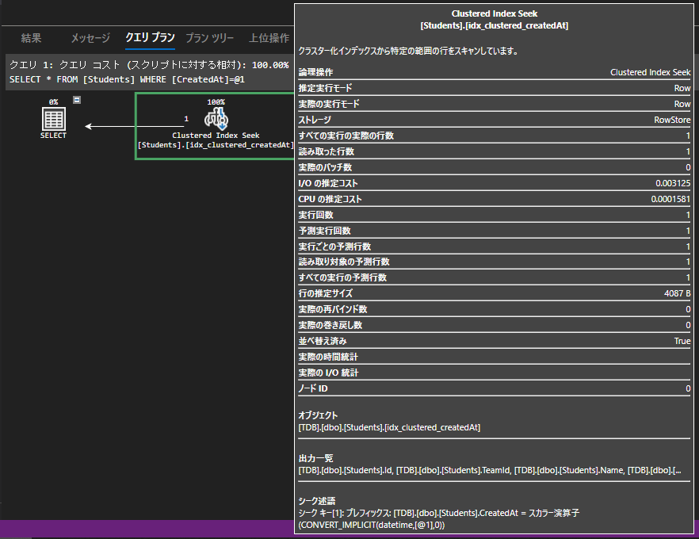
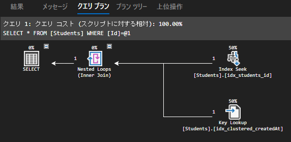
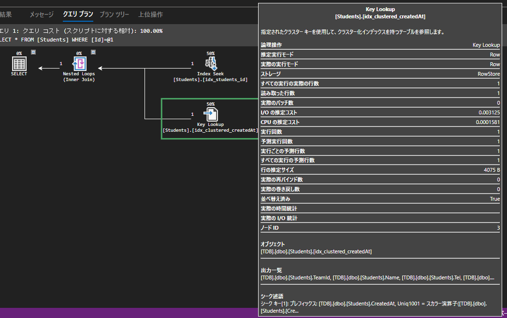
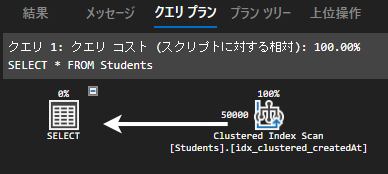

---
tags:
  - SQL
  - SQLServer
---

# データベースのインデックス

SQLServerを題材に、SQLのインデックスについてまとめる

## インデックスとは

データベースにおけるインデックスとは、辞書にある索引のようなイメージ

インデックスを付与すると、インデックスをキーとしたクエリを実行した際に効率的な検索が可能となる

## テーブルスキャン

インデックスを貼っていないテーブルに対して検索を実行した場合、テーブルスキャンが実行される

テーブルスキャンは、テーブルをすべて確認してから検索結果を返すので当然遅くなってしまう

```sql
SELECT * FROM Students WHERE Id = 1
```

実行プラン



詳細を確認。I/OやCPUのコストが高くついている状態



## CREATE INDEX
テーブルまたはビューに非クラスター化インデックスを作成する構文
```sql
CREATE INDEX index1 ON schema1.table1 (column1);
```

Employees テーブルに DepartmentID 列に対するインデックスを追加する例
```sql
CREATE INDEX IDX_Employees_DepartmentID ON Employees (DepartmentID);
```

インデックスに指定するカラムは、できる限り要素が少ない（重複しない）ものが良い

YouTubeで[SQL を速くするインデックス入門 : B-Tree や複合インデックスが理解できる](https://www.youtube.com/live/OsIxUT7D728?si=bp3CErlbZT29q2uw)が分かりやすくて良かった


## インデックスの実行結果を確認
インデックスを貼って、再度クエリを実行して実行プランを確認する

### 非クラスター化インデックス
```sql
-- 非クラスター化インデックスの作成
CREATE INDEX idx_students_id ON Students (Id)
GO

SELECT * FROM Students WHERE Id = 1
```

`Id`にインデックスを貼っているので`Index Seek`が実行されている



非クラスター化インデックスによる実行の詳細を確認



### RID Lookup

`RID`は、実データが格納されたデータページ

`RID Lookup`とは、非クラスター化インデックスに含まれないデータを取得するために、データページへランダムI/Oを行う処理

パフォーマンス劣化の原因となる



### クラスター化インデックス
今度は、クラスター化インデックスの実行結果を確認する

```sql
-- クラスター化インデックスの作成
CREATE CLUSTERED INDEX idx_clustered_createdAt ON Students (CreatedAt)
GO

SELECT * FROM Students WHERE CreatedAt = '2010-07-23 12:19:45.000'
```






クラスター化インデックスを作成すると、`RID Lookup`ではなく`Kye Lookup`（キーを参照）するように変更される<br>
※データページを見に行く（ポインタを探す）のではなく、直接データを探しに行く





ちなみに、クラスター化インデックスを作成後に全件検索すると、テーブルスキャンではなくインデックススキャンとなる<br>
※インデックスを全部見たということ => `seek`ではなく`scan`するのは遅い



※基本的に、プライマリーキーを作成するとクラスター化インデックスが作成される<br>
※ユニークキーを作成すると、非クラスター化インデックスができる

## クラスター化インデックスと非クラスター化インデックスの違い

クラスター化インデックスは、高速な検索を実現できるが、作成数が限られる

一方、非クラスター化インデックスは、検索速度向上と作成数の自由度のバランスが取れている

それぞれの違いを以下の表にまとめる

### データの格納方法
| 項目 | クラスター化インデックス | 非クラスター化インデックス |
|---|---|---|
| 格納方法 | データ行そのものをインデックスキー順に格納 | データ行とは別の構造として格納 |
| 特徴 | インデックスを辿るだけでデータ行に直接アクセス可能 | インデックスからポインタを使ってデータ行にアクセス |

### 作成できる数
| 項目 | クラスター化インデックス | 非クラスター化インデックス |
|---|---|---|
| 作成数 | テーブルに1つだけ | テーブルに複数 |

### 用途
| 項目 | クラスター化インデックス | 非クラスター化インデックス |
|---|---|---|
| 適している場面 | 主キーや頻繁にソート・結合される列 | 頻繁に検索される列 |
| 利点 | テーブル全体をスキャンするクエリのパフォーマンス向上 | 特定の列のみを検索するクエリのパフォーマンス向上 |
| 欠点 | データ更新・挿入処理への影響 | データ更新・挿入処理への影響が少ない |

## 付加列インデックスとは
付加列インデックスは、非クラスター化インデックスの一種

- インデックスキーに加えて任意の列をデータページに格納することで、データ参照のパフォーマンスを向上させる
- 付加列インデックスを使用すると、インデックスをキーとして迅速にデータにアクセスできる

```sql
CREATE INDEX index1 ON schema1.table1 (column1) INCLUDE (column2, column3);
```
この例では、column1 に対するインデックスが作成され、column2 と column3 が付加されている

column1 をキーとしてデータを迅速に検索でき、同時に column2 と column3 の値も取得できる

## インデックス設計のポイント

### インデックス設計の流れ
- クエリを実行後、実行プランを確認
- ボトルネックを見つける
- インデックスを作成した後、実行プランを確認して効果を検証する

- 良いselectivityが得られる最小カラム構成
- SELECT句でしか使わないカラムは基本、付加列にする
- できるだけ少ないインデックスで、クエリの最適化をはかる

[SQLの選択度（selectivity）について](https://pixcelo.github.io/whakamarie/Database/sql_selectivity/)

## インデックスの設計タイミング

### テーブルが追加される場合
- 実行を想定されるクエリをすべて作成してリストアップ
- 各クエリに対して、最適なインデックスを設計する（個別最適）
- 個別最適されたインデックスをまとめる（全体最適）

### 既存クエリをチューニングする場合
- チューニングしたいクエリ（ボトルネック）に最適なインデックスを設計（個別最適）
- 既存インデックスとまとめらえるインデックスをまとめる（全体最適）

## インデックスが効かないケースに注意
- 暗黙の型変換が行われる場合 => 文字列はきちんと`'`で囲むべき
- カラムが加工されている場合
- LIKE句で%から始まる場合

## Reference
- [インデックス](https://learn.microsoft.com/ja-jp/sql/relational-databases/indexes/indexes?view=sql-server-ver16&source=recommendations)
- [付加列インデックスの作成](https://learn.microsoft.com/ja-jp/sql/relational-databases/indexes/create-indexes-with-included-columns?view=sql-server-ver16)
- [クラスター化インデックス](https://learn.microsoft.com/ja-jp/sql/t-sql/statements/create-index-transact-sql?view=sql-server-ver16#clustered-indexes)
- [CREATE INDEX (Transact-SQL)](https://learn.microsoft.com/ja-jp/sql/t-sql/statements/create-index-transact-sql?view=sql-server-ver16)
- [SQL Server と Azure SQL のインデックスのアーキテクチャとデザイン ガイド](https://learn.microsoft.com/ja-jp/sql/relational-databases/sql-server-index-design-guide?view=sql-server-ver16)