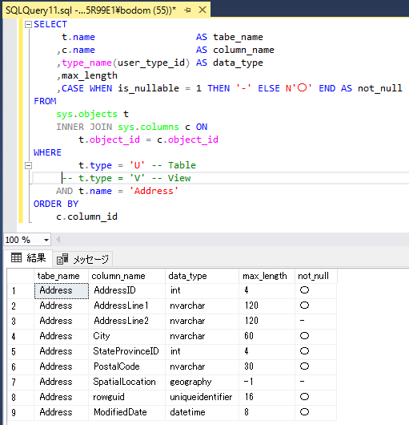

---
tags:
  - SQLServer
  - SQL
---

# SQLServer テーブルのカラム情報をクエリで取得する

クエリからテーブル情報を取得する方法

## Usage

WHERE句で、テーブル名とテーブルタイプを指定できる

- `t.type = 'U'` : テーブル
- `t.type = 'V'` : ビュー

```sql
SELECT
     t.name                  AS tabe_name
    ,c.name                  AS column_name
    ,type_name(user_type_id) AS data_type
    ,max_length
    ,c.precision             AS 有効桁数_整数
    ,c.scale                 AS 小数点桁数
    ,CASE WHEN is_nullable = 1 THEN '-' ELSE N'〇' END AS not_null
FROM
    sys.objects t
    INNER JOIN sys.columns c ON
        t.object_id = c.object_id
WHERE
        t.type = 'U' -- Table
     -- t.type = 'V' -- View
    AND t.name = 'Address'
ORDER BY
    c.column_id
```



## Reference
[sys.columns (Transact-SQL)](https://learn.microsoft.com/ja-jp/sql/relational-databases/system-catalog-views/sys-columns-transact-sql?view=sql-server-ver16)
