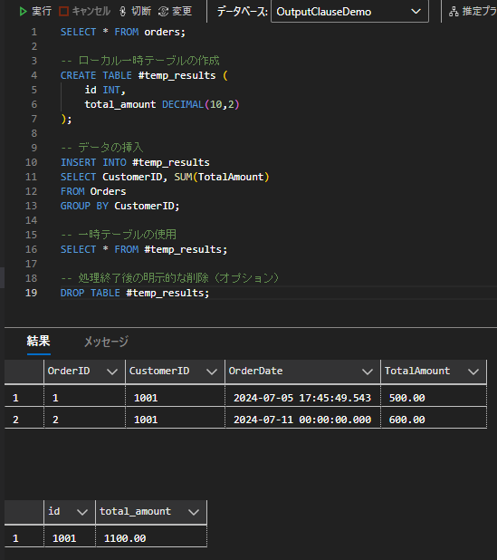

---
tags:
  - SQLServer
  - SQL
---

# SQLServerにおけるセッションと一時テーブルの活用

セッションと一時テーブルを組み合わせることで、パフォーマンスの向上や複雑なデータ処理を効率的に行うことができる

## セッションとは

セッションは、ユーザーがデータベースに接続してから切断するまでの一連の操作を指す

各セッションは独立しており、セッション変数やテンポラリオブジェクトはそのセッション内でのみ有効となる

## 一時テーブルとは

一時テーブルは、セッション内で一時的に使用されるテーブル

主に2種類
- ローカル一時テーブル (#テーブル名): 作成したセッションでのみアクセス可能
- グローバル一時テーブル (##テーブル名): 全てのセッションからアクセス可能


### 一時テーブルの保存先
一時テーブルは、tempdbシステムデータベースに物理的に保存される

これにより、メインのデータベースへの負荷を軽減し、パフォーマンスを向上させることができる

### 一時テーブルの破棄

一時テーブルは以下のいずれかの方法で破棄される

- セッションの終了時に自動的に破棄
- DROP TABLE文による明示的な破棄
- 作成したストアドプロシージャの実行終了時

## Usage

一時テーブルの使用例

```sql
SELECT * FROM orders;

-- ローカル一時テーブルの作成
CREATE TABLE #temp_results (
    id INT,
    total_amount DECIMAL(10,2)
);

-- データの挿入
INSERT INTO #temp_results
SELECT CustomerID, SUM(TotalAmount)
FROM Orders
GROUP BY CustomerID;

-- 一時テーブルの使用
SELECT * FROM #temp_results;

-- 処理終了後の明示的な削除（オプション）
DROP TABLE #temp_results;
```

実行結果<br />



## Reference
- [メモリ最適化を使用した一時テーブルとテーブル変数の高速化](https://learn.microsoft.com/ja-jp/sql/relational-databases/in-memory-oltp/faster-temp-table-and-table-variable-by-using-memory-optimization?view=sql-server-ver16)
- [tempdb データベース](https://learn.microsoft.com/ja-jp/sql/relational-databases/databases/tempdb-database?view=sql-server-ver16)