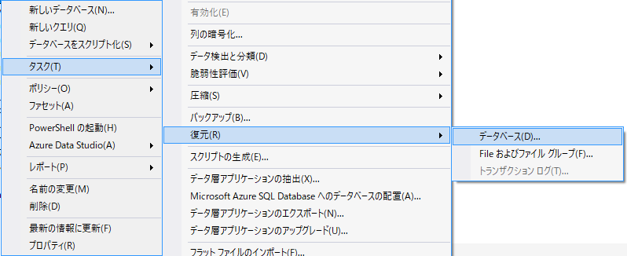
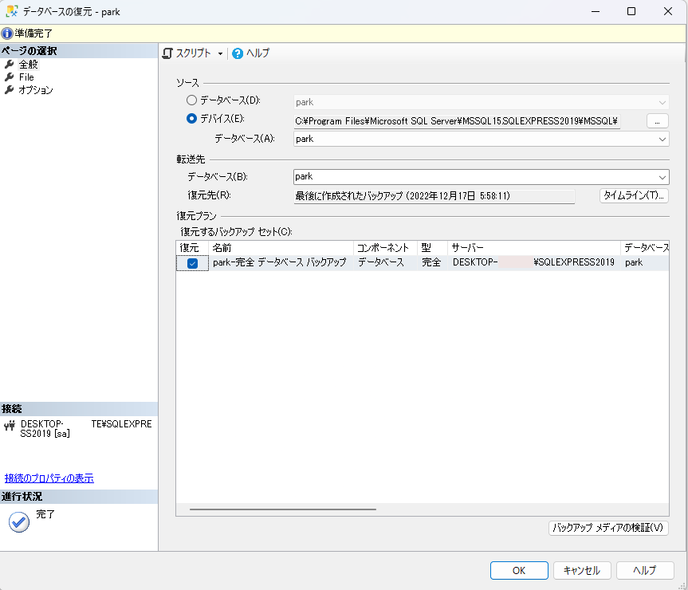
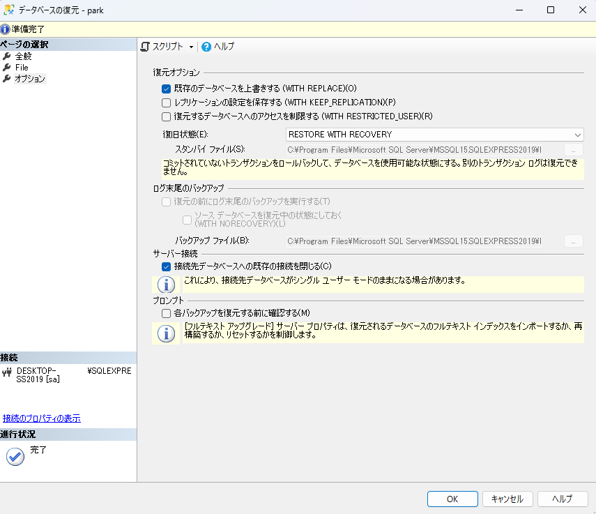
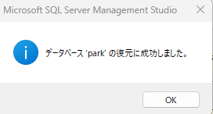

---
tags:
  - SQL
  - SQLServer
  - SSMS
---

# SSMS バックアップから復元（レストア）を行う

SSMS (`SQL Server Management Studio`)で、デバイスのバックアップファイルから復元（レストア）を行う

## Operation

オブジェクトエクスプローラーのペインから、復元するデータベースを右クリック -> タスク -> 復元 -> データベースを選択

データベースの復元メニューでデバイスからバックアップファイルを参照

オプション -> 復元オプション -> 既存のデータベースを上書きする（WITH REPLACE) にチェック

サーバー接続 -> 接続先データベースへの既存の接続を閉じる にチェック

成功メッセージが出ればバックアップの復元が完了

## Reference
* [SSMS を使用してデータベース バックアップを復元する](https://learn.microsoft.com/ja-jp/sql/relational-databases/backup-restore/restore-a-database-backup-using-ssms?view=sql-server-ver16)
* [AdventureWorks サンプル データベース](https://learn.microsoft.com/ja-jp/sql/samples/adventureworks-install-configure?view=sql-server-ver16&tabs=ssms)
