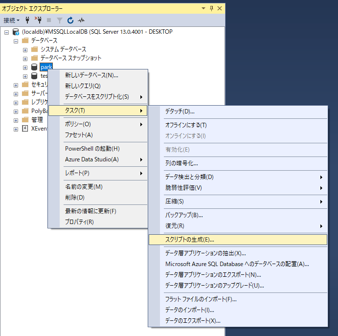
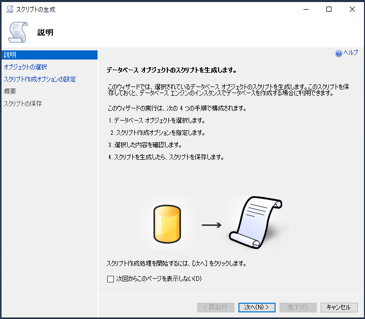
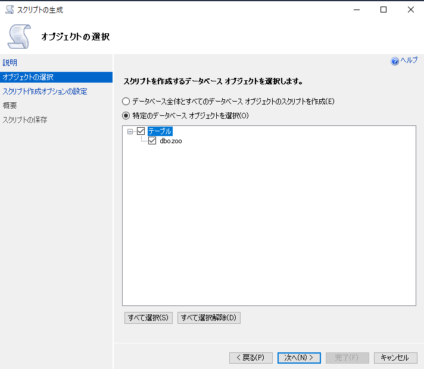
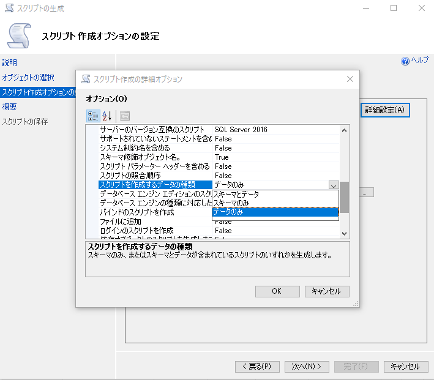
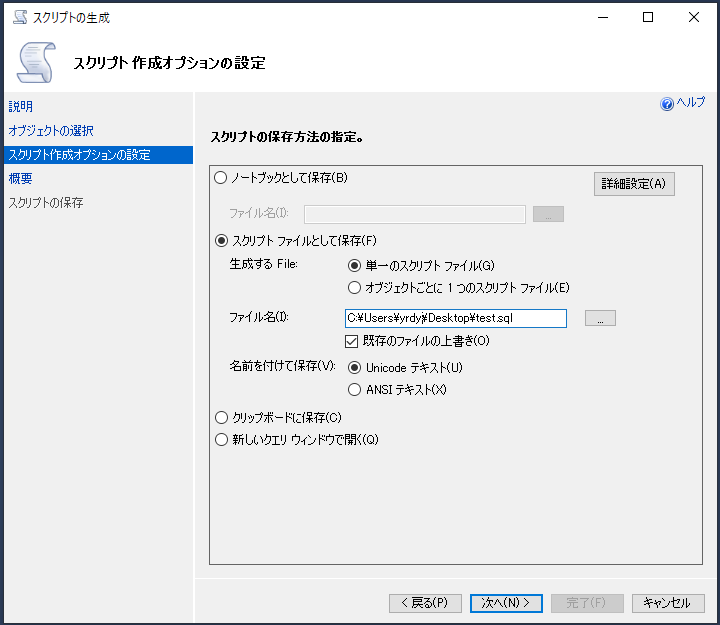
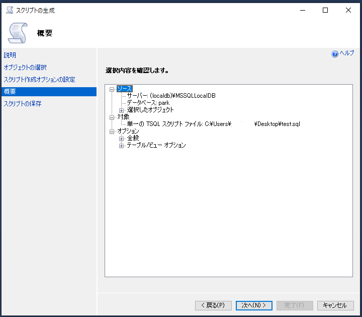
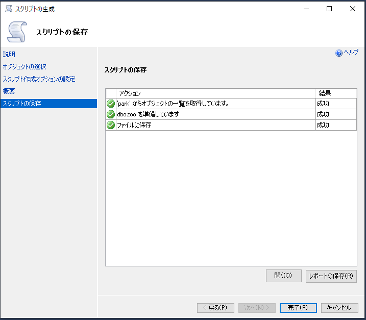
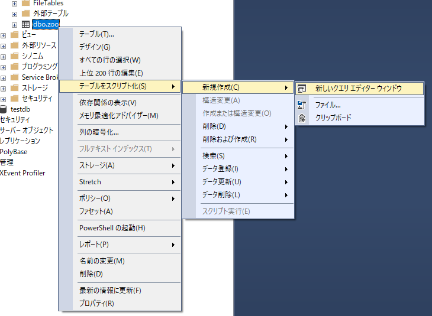

# SQLServer SSMSでテーブルをスクリプト化する

1. データベース名をクリックして、タスク→スクリプトの作成と進む 

2. 次へを選択 

3. 出力したいテーブルを選択 

4. 「詳細設定」をクリックして、「スクリプトを作成するデータの種類」から選択 
「スキーマとデータ」を選ぶとテーブル作成、データ挿入の両方のスクリプトが作成される 

5. 出力先の設定を選択 

6. 概要の確認、次へを選択 

7. この画面がでたら完了 

## 単一のテーブルの場合
単一のテーブルのスクリプトを生成するならテーブルを右クリックが早い 

