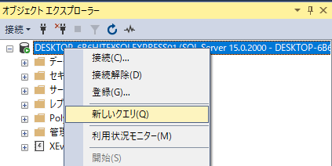
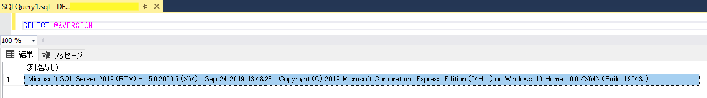

# SQLServer SSMS のバージョンを確認する

SQLServeはバージョンによって実行できないT-SQLがある（新しい文法は古いバージョンでサポートされていない）<br>
実行環境のバージョンを確認したいときに使用

 ## Usage
```sql
SELECT @@VERSION
```

データベースから新しいクエリを選択して<br>


`SELECT @@VERSION`を入力すると、結果が表示される<br>

