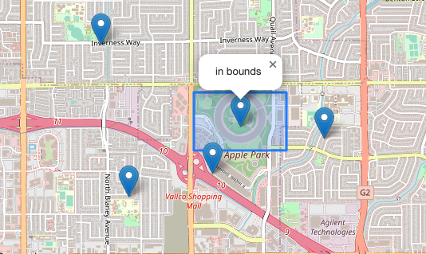
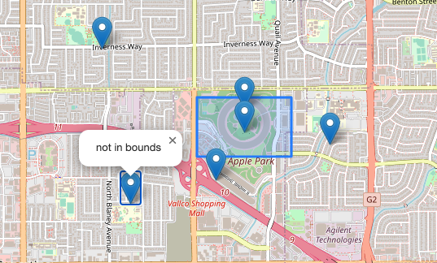

---
tags:
  - JavaScript
  - Leaflet
  - GIS
---

# Leaflet マーカーが範囲内かどうかを判定する
`getBounds()`は`LatLngBounds`を返すメソッド<br>
`e.g. [[40.712, -74.227],[40.774, -74.125]]`<br><br>

`contains()`は`bool`を返すメソッド<br>
対象が範囲内にあれば`true`となる

## Usage
```html
<!DOCTYPE html>
<html lang="ja">
<head>
    <meta charset="UTF-8">
    <meta http-equiv="X-UA-Compatible" content="IE=edge">
    <meta name="viewport" content="width=device-width, initial-scale=1.0">
    <title>Document</title>
    <style>
    #map {
        width: 540px;
        height: 540px;
    }
    </style>
    <link rel="stylesheet" href="../leaflet/leaflet.css" />
    <script src="../leaflet/leaflet.js"></script>
</head>
<body>
    <div id="map"></div>
</body>
<script>

    const map = L.map('map').setView([37.334, -122.009], 13);

    L.tileLayer('https://tile.openstreetmap.org/{z}/{x}/{y}.png', {
        maxZoom: 19,
        attribution: '&copy; <a href="http://www.openstreetmap.org/copyright">OpenStreetMap</a>'
    }).addTo(map);

    const rectangle = L.rectangle([[37.337, -122.014],[37.332, -122.004]]).addTo(map);

    const markers = [
        [37.334, -122.009],
        [37.336, -122.009],
        [37.333, -122.000],
        [37.341, -122.024],
        [37.330, -122.012],
        [37.328, -122.021]
    ]

    for (let i = 0; i < markers.length; i++) {
        const bounds = rectangle.getBounds();
        const isInBounds = bounds.contains(markers[i]);

        const content = isInBounds ? 'in bounds' : 'not in bounds';
        const marker = L.marker(markers[i])
                        .addTo(map)
                        .bindPopup(content)
                        .openPopup();
    }

</script>
</html>
```
中央の長方形の範囲内にマーカーが含まれていれば「in bounds」と表示される<br>
<br>

範囲外なら「not in bounds」<br>
<br>

ライブラリの中で、面倒な比較をやってくれている<br>
```javascript
// @method contains(otherBounds: Bounds): Boolean
// Returns `true` if the rectangle contains the given one.
// @alternative
// @method contains(point: Point): Boolean
// Returns `true` if the rectangle contains the given point.
contains: function (obj) {
    var min, max;

    if (typeof obj[0] === 'number' || obj instanceof Point) {
        obj = toPoint(obj);
    } else {
        obj = toBounds(obj);
    }

    if (obj instanceof Bounds) {
        min = obj.min;
        max = obj.max;
    } else {
        min = max = obj;
    }

    return (min.x >= this.min.x) &&
            (max.x <= this.max.x) &&
            (min.y >= this.min.y) &&
            (max.y <= this.max.y);
},
```
mapオブジェクトも`getBounds()`や`contains()`のメソッドを持つので<br>
表示されている範囲内のマーカーだけに何かしらの処理をするといったときに使える<br>

## Sandbox
<iframe src="https://codesandbox.io/embed/leaflet-bounds-hbww8j?fontsize=14&hidenavigation=1&theme=dark"
     style="width:100%; height:500px; border:0; border-radius: 4px; overflow:hidden;"
     title="leaflet_bounds"
     allow="accelerometer; ambient-light-sensor; camera; encrypted-media; geolocation; gyroscope; hid; microphone; midi; payment; usb; vr; xr-spatial-tracking"
     sandbox="allow-forms allow-modals allow-popups allow-presentation allow-same-origin allow-scripts"
></iframe>

## Reference
[Leaflet](https://leafletjs.com/reference.html#rectangle)<br>

## ソースコード
* [GitHub](https://github.com/pixcelo/Leaflet/blob/main/003/index.html)
