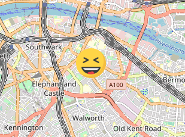
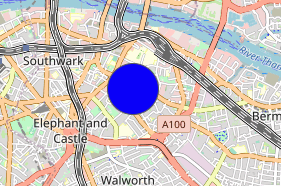

# Leaflet.js でマーカーをカスタマイズする
Leaflet.jsのマーカーを任意に変更する方法
CSSや画像を使うことで地図上に好きなものを置ける

## マーカーに画像をセットする
画像を置くには`L.icon`クラスで画像を定義したアイコンを作成して、マーカーにアイコンを設定する
```javascript
const customIcon = L.icon({
    iconUrl: '../img/laughing.png',
    iconSize: [50, 50]
});

const pngMarker = L.marker([51.5, -0.09], {icon: customIcon}).addTo(map);
```


## CSSを指定する
`L.divIcon`クラスでCSSを指定することができる
```javascript
const divIcon = L.divIcon({
    className: 'iconClass',
    iconSize: [50, 50]
});

const divMarker = L.marker([51.5, -0.09], {icon: divIcon}).addTo(map);
```
<br/>

## ソースコード

[GitHub](https://github.com/pixcelo/Leaflet/blob/main/002/index.html)
