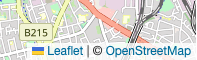

---
tags:
  - JavaScript
  - Leaflet
  - GIS
---

# Leaflet 属性リンクを別タブで開く

Leafletの地図を利用する場合、デフォルトで画面の右下にLeafletへのリンクが表示される



属性リンクは利用規約上、必要なものだが意図せずクリックすると画面遷移してしまう

ユーザビリティとしては良くないので、下記に示す方法で属性リンクの記述を変更する

## Usage

`map.attributionControl.setPrefix()`で地図の属性リンクを上書きする

```javascript
map.attributionControl.setPrefix(`
    <a href="https://leafletjs.com" title="A JavaScript library for interactive maps" target="_blank">
        Leaflet
    </a>`
);
```

## Reference
* [Leaflet](https://leafletjs.com)
