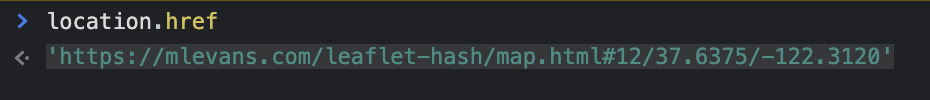

---
tags:
  - JavaScript
  - Leaflet
  - GIS
---

# Leaflet URLハッシュを使用する

URLハッシュとは
* URLの「#」よりも後ろの部分を指す
* アンカーリンク、ハッシュリンクとして利用される
* WEBページ内のリンクとして用いられる

Leafletプラグインを利用して、URLハッシュを記録することができる

e.g.<br>
現在、表示している緯度・経度などをデータベースに保存するなど

## Usage
```javascript
const hash = new L.Hash(map);
```

`new L.Hash(map)`でインスタンスを呼んだ後に`location.href`で確認すると、ハッシュ付きのURLを取得できる



## Reference
* [Leaflet](https://leafletjs.com/reference.html#rectangle)
* [Leaflet-hash](https://github.com/mlevans/leaflet-hash)
* [Demo](https://mlevans.com/leaflet-hash/map.html#12/37.7630/-122.4437)
