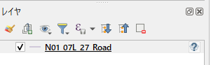
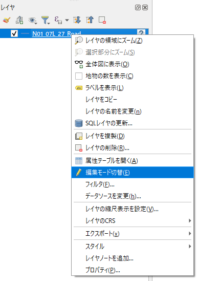
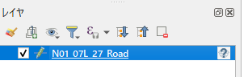
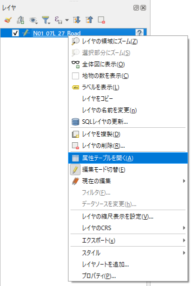
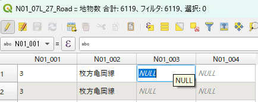
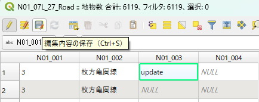

---
tags:
  - GIS
---

# QGIS 属性テーブルを編集する

## Topic

- 属性テーブルを編集・保存する

## Usage

1. レイヤーを表示

ドラッグ&ドロップでレイヤーを表示する

2. 右クリックメニューで編集モード切替を選択

3. 編集モードに切り替わると、レイヤー上でペンのマークに変化する

4. 属性テーブルを開く

5. 編集ができるようになる

6. フロッピーのマークで保存

属性テーブルを開いた後に、ペンマークをクリックすることで編集モードに切り替えることも可能

## Reference
- [QGIS](https://qgis.org/ja/site/)