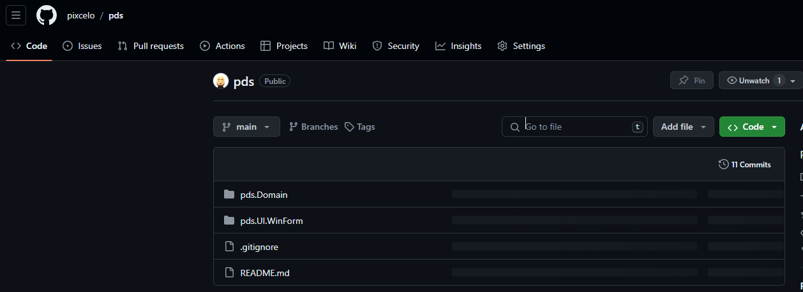
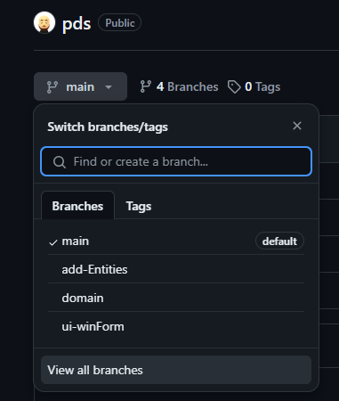
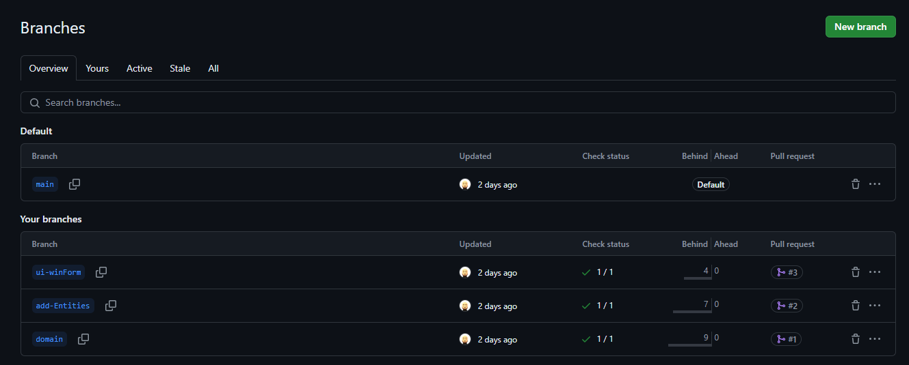
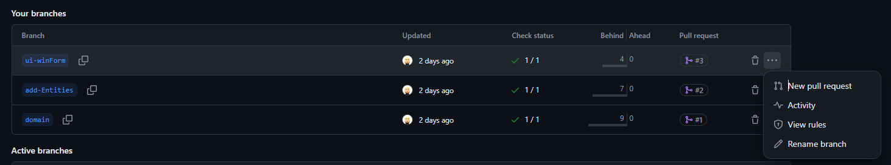
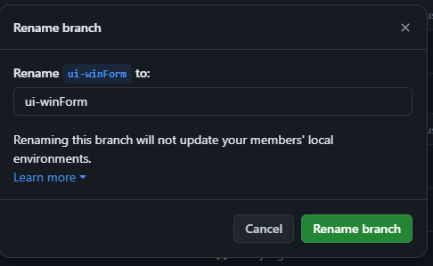

---
tags:
  - git
---

# Git GitHubのブラウザ画面からリモートブランチ名を変更する

## 手順
1. GitHubでリポジトリを開く 

2. [View all branches]をクリック

3. ブランチの一覧が表示される

4. 名前を変更したいブランチの[...]を右クリックして、[Rename branch]をクリック

この画面でブランチ名を変更する

## Reference
- [ブランチの名前を変更する](https://docs.github.com/ja/repositories/configuring-branches-and-merges-in-your-repository/managing-branches-in-your-repository/renaming-a-branch)