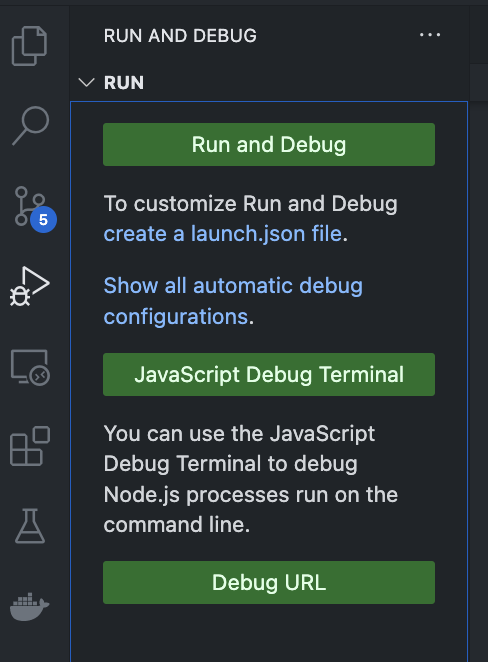
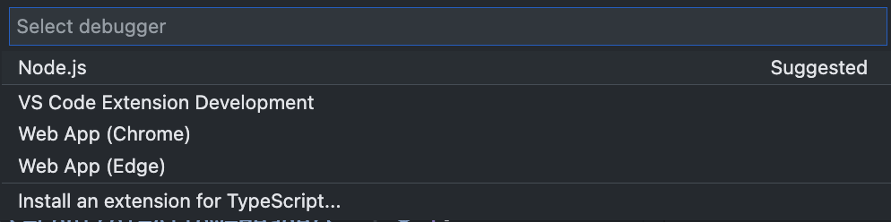

# Visual Studio Code のデバッグ設定
`Node.js`でのデバッグの設定方法をメモする

## launch.json作成
サイドバーのデバッグボタンから`create a launch.json file`を選択<br>

<br>

`Node.js`を選択<br>

<br>

`.vscode`フォルダと`launch.json`が作成される<br>
このファイルに対してデバッグの設定を記述する<br>
```json
{
    "version": "0.2.0",
    "configurations": [
        {
            "type": "node",
            "request": "launch",
            "name": "Launch Program",
            "skipFiles": [
                "<node_internals>/**"
            ],
            "program": "${workspaceFolder}/app/src/index.ts",
            "outFiles": [
                "${workspaceFolder}/**/*.js"
            ]
        }
    ]
}
```

`runtimeArgs`にデバッグする実行ランタイムを指定する
```json
{
    "version": "0.2.0",
    "configurations": [
        {
            "type": "node",
            "request": "launch",
            "name": "TypeScript Program",
            "skipFiles": [
                "<node_internals>/**"
            ],
            "runtimeArgs": ["-r", "ts-node/register"], # runtimeArgs を追加する
            "program": "${workspaceFolder}/app/src/index.ts",
            "outFiles": [
                "${workspaceFolder}/**/*.js"
            ]
        }
    ]
}
```

## Reference

[Debugging in Visual Studio Code](https://code.visualstudio.com/docs/editor/debugging#_launch-configurations)<br>
[Node.js debugging with Visual Studio Code](https://code.visualstudio.com/docs/nodejs/nodejs-debugging)<br>
[TypeScript debugging with Visual Studio Code](https://code.visualstudio.com/docs/typescript/typescript-debugging)<br>
