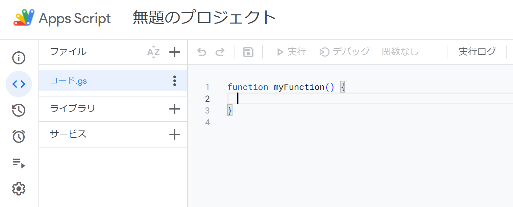

---
tags:
  - Google Apps Script
  - JavaScript
  - TypeScript
---

# Google Apps Script 「clasp」を用いてローカル環境からTypeScriptで開発

GAS（Google Apps Script）は、通常 Apps Scriptのエディターを用いて開発する



これでも開発は可能だが、やはり「いつもの使い慣れた環境で開発したい！」という人は<br />
`clasp`を使うと幸せになれる

## 実行環境
npmが必要、なければ`nvm`や`nodebrew`等でインストールしておく
```bash
$ npm -v
10.2.4
```

## claspの設定
事前に、[Apps Scriptの設定](https://script.google.com/home/usersettings)にてGoogle Apps Script APIをオンにする

`clasp`をローカル環境にインストール
```bash
$ npm install -g @google/clasp
```

`clasp`のバージョン確認
```bash
$ clasp -v   
2.4.2
```

TypeScripの型定義ファイルのインストール
```bash
$ npm init -y
$ npm i -D @types/google-apps-script
```

`tsconfig.json`を作成
```json
{
  "compilerOptions": {
    "lib": ["esnext"],
    "experimentalDecorators": true
  }
}
```

## claspにログインする
`clasp login`を実行すると、ブラウザが開く
```bash
$ clasp login
Logging in globally…
🔑 Authorize clasp by visiting this url:
https://accounts.google.com/o/oauth2/v2/auth?access_type=offline&scope=https...
```

`clasp`でのログインを許可すると、以下のメッセージがブラウザで表示される
```
Logged in! You may close this page. 
```

## TypeScriptでプロジェクトを作成する
`clasp create`コマンドを実行する
```bash
$ clasp create --type standalone
```
`.clasp.json`、`appsscript.json`等の設定ファイルが作成される

`.clasp.json`の`scriptId`がGASのプロジェクトID
```json
{"scriptId":"...","rootDir":"C:\\Users\\user\\Documents\\example-gas-ts"}
```

`appsscript.json`の初期タイムゾーンは`America/New_York`となっている
```json
{
  "timeZone": "America/New_York",
  "dependencies": {
  },
  "exceptionLogging": "STACKDRIVER",
  "runtimeVersion": "V8"
}
```

`.ts`ファイルを作成する
```bash
const greeter = (person: string) => {
  return `Hello, ${person}!`;
}

function testGreeter() {
  const user = 'Grant';
  Logger.log(greeter(user));
}
```

## プロジェクトをApps Scriptに反映させる
`clasp push`で先ほど作成した`.ts`がGASに反映される
```bash
$ clasp push
```
`--watch`オプションを付与すると、ファイルの変更を監視してコンパイル・アップロードされる

`clasp open`でブラウザでGASの画面を表示できる
```bash
$ clasp open
```

`.ts`は`.gs`に変換され、プロジェクトに反映される
```js
// Compiled using insight-gas-ts 1.0.0 (TypeScript 4.9.5)
"use strict";
var greeter = function (person) {
    return "Hello, ".concat(person, "!");
};
function testGreeter() {
    var user = 'Grant';
    Logger.log(greeter(user));
}
```

## 既存のプロジェクトをpullする
`clasp clone`で作成済みのプロおジェクトを使用できる
```bash
clasp clone {プロジェクトID}
```

## Reference
- [clasp](https://github.com/google/clasp)
- [Google Apps Script](https://www.google.com/script/start/)
- [Apps Script](https://developers.google.com/apps-script?hl=ja)
- [TypeScript を使用した Apps Script の開発](https://developers.google.com/apps-script/guides/typescript?hl=ja)