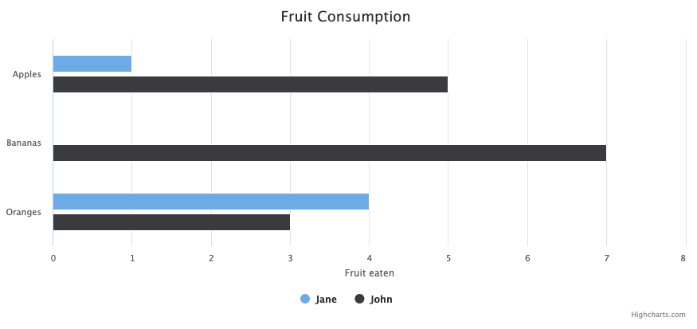

# Highcharts JavaScriptグラフ描画ライブラリ
[Highcharts](https://www.highcharts.com/)<br>
JavaScriptの高機能なグラフライブラリ<br>
個人で利用する範囲であれば無料で使える<br>
[Demo](https://www.highcharts.com/demo)にて様々なグラフを参照可能

## Usage
1. CDNを読み込む
```html
<script src="https://code.highcharts.com/highcharts.js"></script>
```

2. チャートを表示する場所を用意
```html
<body>
    <div id="container" style="width:100%; height:400px;"></div>
</body>
```

3. JavaScriptを書く
```javascript
<script>
    document.addEventListener('DOMContentLoaded', function () {
    const chart = Highcharts.chart('container', {
        chart: {
            type: 'bar'
        },
        title: {
            text: 'Fruit Consumption'
        },
        xAxis: {
            categories: ['Apples', 'Bananas', 'Oranges']
        },
        yAxis: {
            title: {
                text: 'Fruit eaten'
            }
        },
        series: [{
            name: 'Jane',
            data: [1, 0, 4]
        }, {
            name: 'John',
            data: [5, 7, 3]
        }]
    });
});
</script>
```
これだけでインタラクティブなグラフが表示される<br>


[株価チャート](https://jsfiddle.net/gh/get/library/pure/highcharts/highcharts/tree/master/samples/stock/demo/basic-line/)で実装する場合も簡単にできる

## Reference

[Your first chart](https://www.highcharts.com/docs/getting-started/your-first-chart)<br>
[jsfiddle](https://jsfiddle.net/highcharts/kh5jY/)
