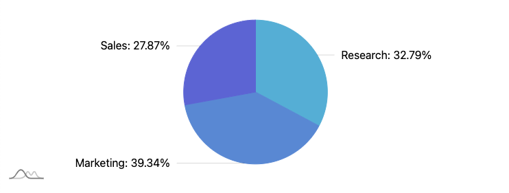
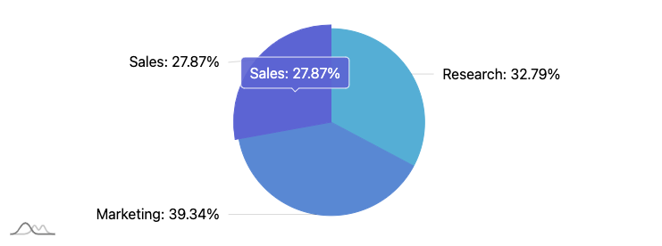

# JavaScript チャートライブラリ amCharts
amChartsについて調べたのでメモ<br>
価格チャートを表示し、グラフ上で操作するためのライブラリを調査している<br>
bitFlyerのサイトを開発ツールで見ていたら、このライブラリを読み込んでいることを確認した<br>

[公式サイト](https://www.amcharts.com/download/)の説明によると無料版と有料版の違いは<br>
amChartsのロゴが表示がされるかどうかとのこと<br>
個人利用の範囲なら問題なく使えそうだ<br>
>You can download and use all amCharts 5 products for free. The only limitation<br>
>of the free version is that a small amCharts logo will be displayed in the corner of<br>
>your charts. If you’d rather have your charts without any branding, or you<br>
>appreciate the software and would like to support its creators, please purchase<br>
>a commercial license.<br>

## Usage
amChart5をCDN経由で使ってみる<br>

```html
<!DOCTYPE html>
<html lang="ja">
<head>
    <meta charset="UTF-8">
    <meta http-equiv="X-UA-Compatible" content="IE=edge">
    <meta name="viewport" content="width=device-width, initial-scale=1.0">
    <title>Document</title>
    <script src="https://cdn.amcharts.com/lib/5/index.js"></script>
    <script src="https://cdn.amcharts.com/lib/5/xy.js"></script>
    <script src="https://cdn.amcharts.com/lib/5/percent.js"></script>
</head>
<body>
    <div id="chartdiv" style="width: 50%; height: 30vh;"></div>

    <script>
        var root = am5.Root.new("chartdiv");

        var chart = root.container.children.push(
            am5percent.PieChart.new(
                root, {}
            )
        );

        var series = chart.series.push(
            am5percent.PieSeries.new(
                root, {
                    valueField: "value",
                    categoryField: "category"
                }
            )
        );

        series.data.setAll([{
            category: "Research",
            value: 1000
        }, {
            category: "Marketing",
            value: 1200
        }, {
            category: "Sales",
            value: 850
        }]);

    </script>
</body>
</html>
```
パイチャートを表示<br>
<br>


マウスホバーするとインタラクティブにデータが表示される<br>
<br>
左下のロゴが、商用ライセンス購入で削除できるamChartsへのリンク

## ソースコード
[pie chart](https://gist.github.com/pixcelo/d472bcc889f3b2912850941951d77408)

## Reference
[amcharts](https://www.amcharts.com/)<br>
[getting-started](https://www.amcharts.com/docs/v5/getting-started/)<br>
