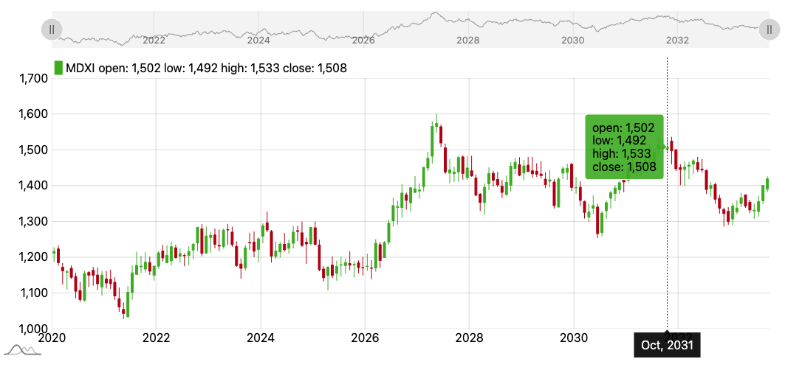

# JavaScript チャートライブラリ amCharts5で株価チャートを作成
amChartsで株価チャートを表示する方法<br>

## Usage
amChart5をCDNで使用<br>

```html
<!DOCTYPE html>
<html lang="ja">
<head>
    <meta charset="UTF-8">
    <meta http-equiv="X-UA-Compatible" content="IE=edge">
    <meta name="viewport" content="width=device-width, initial-scale=1.0">
    <title>Document</title>
    <script src="https://cdn.amcharts.com/lib/5/index.js"></script>
    <script src="https://cdn.amcharts.com/lib/5/xy.js"></script>
    <script src="https://cdn.amcharts.com/lib/5/themes/Animated.js"></script>
    <style>
        #chartdiv {
          width: 100%;
          height: 500px;
        max-width: 100%
        }
    </style>
</head>
<body>
    <div id="chartdiv"></div>

    <script>
        // Create root element
        // https://www.amcharts.com/docs/v5/getting-started/#Root_element
        const root = am5.Root.new("chartdiv");

        // Set themes
        // https://www.amcharts.com/docs/v5/concepts/themes/
        root.setThemes([am5themes_Animated.new(root)]);

        function generateChartData() {
        const chartData = [];
        let firstDate = new Date();
        firstDate.setDate(firstDate.getDate() - 1000);
        firstDate.setHours(0, 0, 0, 0);
        let value = 1200;
        for (let i = 0; i < 5000; i++) {
            const newDate = new Date(firstDate);
            newDate.setDate(newDate.getDate() + i);

            value += Math.round((Math.random() < 0.5 ? 1 : -1) * Math.random() * 10);
            const open = value + Math.round(Math.random() * 16 - 8);
            const low = Math.min(value, open) - Math.round(Math.random() * 5);
            const high = Math.max(value, open) + Math.round(Math.random() * 5);

            chartData.push({
                date: newDate.getTime(),
                value: value,
                open: open,
                low: low,
                high: high
            });
        }
        return chartData;
        }

        const data = generateChartData();

        // Create chart
        // https://www.amcharts.com/docs/v5/charts/xy-chart/
        const chart = root.container.children.push(
        am5xy.XYChart.new(root, {
            focusable: true,
            panX: true,
            panY: true,
            wheelX: "panX",
            wheelY: "zoomX"
        })
        );

        // Create axes
        // https://www.amcharts.com/docs/v5/charts/xy-chart/axes/
        const xAxis = chart.xAxes.push(
        am5xy.DateAxis.new(root, {
            groupData: true,
            maxDeviation:0.5,
            baseInterval: { timeUnit: "day", count: 1 },
            renderer: am5xy.AxisRendererX.new(root, {pan:"zoom"}),
            tooltip: am5.Tooltip.new(root, {})
        })
        );

        const yAxis = chart.yAxes.push(
        am5xy.ValueAxis.new(root, {
            maxDeviation:1,
            renderer: am5xy.AxisRendererY.new(root, {pan:"zoom"})
        })
        );

        const color = root.interfaceColors.get("background");

        // Add series
        // https://www.amcharts.com/docs/v5/charts/xy-chart/series/
        const series = chart.series.push(
            am5xy.CandlestickSeries.new(root, {
                fill: color,
                calculateAggregates: true,
                stroke: color,
                name: "MDXI",
                xAxis: xAxis,
                yAxis: yAxis,
                valueYField: "value",
                openValueYField: "open",
                lowValueYField: "low",
                highValueYField: "high",
                valueXField: "date",
                lowValueYGrouped: "low",
                highValueYGrouped: "high",
                openValueYGrouped: "open",
                valueYGrouped: "close",
                legendValueText:
                "open: {openValueY} low: {lowValueY} high: {highValueY} close: {valueY}",
                legendRangeValueText: "{valueYClose}",
                tooltip: am5.Tooltip.new(root, {
                pointerOrientation: "horizontal",
                labelText: "open: {openValueY}\nlow: {lowValueY}\nhigh: {highValueY}\nclose: {valueY}"
                })
            })
        );

        // Add cursor
        // https://www.amcharts.com/docs/v5/charts/xy-chart/cursor/
        const cursor = chart.set(
        "cursor",
        am5xy.XYCursor.new(root, {
            xAxis: xAxis
        })
        );
        cursor.lineY.set("visible", false);

        // Stack axes vertically
        // https://www.amcharts.com/docs/v5/charts/xy-chart/axes/#Stacked_axes
        chart.leftAxesContainer.set("layout", root.verticalLayout);

        // Add scrollbar
        // https://www.amcharts.com/docs/v5/charts/xy-chart/scrollbars/
        const scrollbar = am5xy.XYChartScrollbar.new(root, {
            orientation: "horizontal",
            height: 50
        });
        chart.set("scrollbarX", scrollbar);

        const sbxAxis = scrollbar.chart.xAxes.push(
            am5xy.DateAxis.new(root, {
                groupData: true,
                groupIntervals: [{ timeUnit: "week", count: 1 }],
                baseInterval: { timeUnit: "day", count: 1 },
                renderer: am5xy.AxisRendererX.new(root, {
                opposite: false,
                strokeOpacity: 0
                })
            })
        );

        const sbyAxis = scrollbar.chart.yAxes.push(
            am5xy.ValueAxis.new(root, {
                renderer: am5xy.AxisRendererY.new(root, {})
            })
        );

        const sbseries = scrollbar.chart.series.push(
            am5xy.LineSeries.new(root, {
                xAxis: sbxAxis,
                yAxis: sbyAxis,
                valueYField: "value",
                valueXField: "date"
            })
        );

        // Add legend
        // https://www.amcharts.com/docs/v5/charts/xy-chart/legend-xy-series/
        const legend = yAxis.axisHeader.children.push(am5.Legend.new(root, {}));

        legend.data.push(series);

        legend.markers.template.setAll({
            width: 10
        });

        legend.markerRectangles.template.setAll({
            cornerRadiusTR: 0,
            cornerRadiusBR: 0,
            cornerRadiusTL: 0,
            cornerRadiusBL: 0
        });

        // set data
        series.data.setAll(data);
        sbseries.data.setAll(data);

        // Make stuff animate on load
        // https://www.amcharts.com/docs/v5/concepts/animations/
        series.appear(1000);
        chart.appear(1000, 100);

        </script>
</body>
</html>
```
株価チャートを表示<br>
<br>

インジケーターも標準搭載している<br>
下はMAを表示した状態<br>
<br>

## ソースコード
[stock chart](https://gist.github.com/pixcelo/c6b38a5ad40d81585162d028178d4759)

## Reference
[amcharts](https://www.amcharts.com/)<br>
[amcharts stock](https://www.amcharts.com/docs/v5/charts/stock/)<br>
[amcharts candlestick](https://www.amcharts.com/demos/candlestick-chart/)<br>
[amcharts indicators](https://www.amcharts.com/docs/v5/charts/stock/indicators/)<br>
[amcharts indicators control](https://www.amcharts.com/docs/v5/charts/stock/toolbar/indicator-control/)<br>
[amcharts custom indicators](https://www.amcharts.com/docs/v5/tutorials/creating-custom-indicators-for-a-stock-chart/#Adding_to_toolbar)<br>
