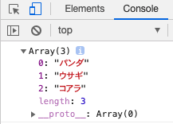
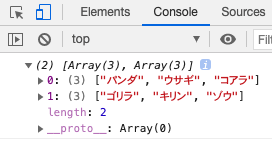
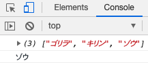

---
tags:
  - JavaScript
---

# JavaScript 配列を扱う

JavaScriptで配列を扱う方法

## Array
JavaScriptの配列は、複数の要素を格納できるオブジェクト

### 配列の中身

```javascript
const animal = ['パンダ', 'ウサギ', 'コアラ']

console.log(animal);
```



### 配列の添字

配列には添字（インデックス）として番号が振られる<br>

添字を指定して、配列の中身を個別に取り出せる

```javascript
const animal = ['パンダ', 'ウサギ', 'コアラ']

console.log(animal[1]);
// ウサギ
```

配列の添字は`0`から始まるので、`animail[1]`と指定すると「ウサギ」が表示される

### 配列の要素数

配列の長さ（配列の中に要素がいくつあるか）を調べるのは`Length`を使います。

```javascript
const animal = ['パンダ', 'ウサギ', 'コアラ']

console.log(animal.length);
// 3
```

## 多次元配列

配列の中にさらに配列を入れることができる

```javascript
const zoo = [
    ['パンダ', 'ウサギ', 'コアラ'],
    ['ゴリラ', 'キリン', 'ゾウ'],
];

console.log(zoo);
```

サンプルでは、２次元配列を`console.log`で確認している



### 配列の添字
通常の配列と同様に、添字を指定して個別に取り出すことも可

```javascript
const zoo = [
    ['パンダ', 'ウサギ', 'コアラ'],
    ['ゴリラ', 'キリン', 'ゾウ'],
];

console.log(zoo[1]);
console.log(zoo[1][2]);
```

`zoo[1]`と指定すると

配列の中から「0から数えて1番目の要素」の「ゴリラ, キリン, ゾウ」が取得できる

`zoo[1][2]`と指定すると

上記の配列の中から2番目の要素「ゾウ」が取得できる



## Reference
[Array MDN](https://developer.mozilla.org/ja/docs/Web/JavaScript/Reference/Global_Objects/Array)<br>
[Array.prototype.length MDN](https://developer.mozilla.org/ja/docs/Web/JavaScript/Reference/Global_Objects/Array/length)<br>
