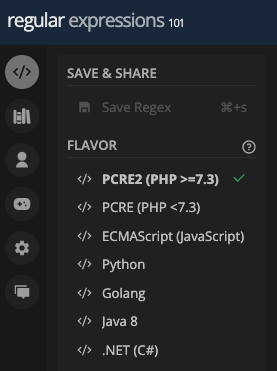
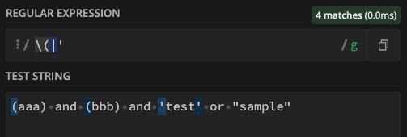
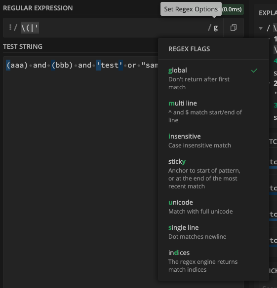
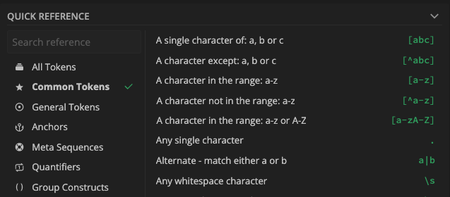

# JavaScript 正規表現のチェックサイト「regex101.com」の使い方

正規表現を使用する際のメモ 
`regex101.com`は、正規表現の使用に使える有益ツール

## Usage
左ペインから調べたい言語を選択 
`ECMAScript(JavaScript)`に変更 

`REGULAR EXPRESSION`に正規表現を入力 
(/*******/g) *の部分を入力 
`TEST STRING`にチェックしたい文字列を入力 
 
文字列を入力すると、自動的に正規表現にマッチする文字がハイライトされる 
上記の例では`/\(|'/g`と入力すると、全ての`(`と`'`がマッチすることがわかる 
 

正規表現を指定する範囲は、オプションの選択肢から変更が可能 
 

右下にて、正規表現のリファレンスが参照できる 
 

## エスケープ
JavaScriptに[文字クラス](https://developer.mozilla.org/ja/docs/Web/JavaScript/Guide/Regular_Expressions/Character_Classes)として定義されている特殊文字は、バックスラッシュ`\`でエスケープする必要がある 
バックスラッシュ`\`は、macなら`option + ¥`で入力できる

## Reference
[MDN 正規表現](https://developer.mozilla.org/ja/docs/Web/JavaScript/Guide/Regular_Expressions) 
[MDN 文字クラス](https://developer.mozilla.org/ja/docs/Web/JavaScript/Guide/Regular_Expressions/Character_Classes) 
[regular expressions 101](https://regex101.com/) 
