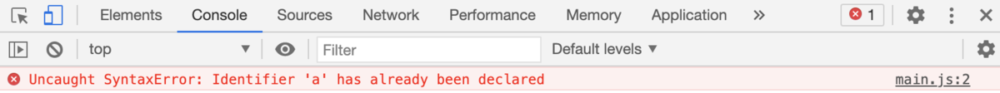
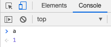
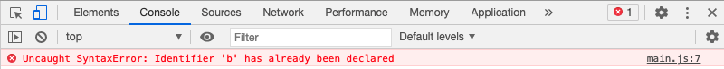
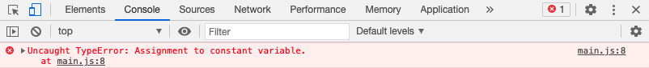
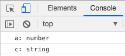

---
tags:
  - JavaScript
---

# JavaScriptで変数を宣言する

JavaScriptの変数を宣言する方法は、下記3つ

- let
- const
- var (非推奨)

`var`は非推奨で、基本的には`let`と`const`を用いる

## Usage

`let`に変数を格納

```javascript
let a = 0;
```

`let`は同じスコープ内で再宣言できず、エラーとなる

```javascript
let a = 0;
let a = 1;
// Uncaught SyntaxError: Identifier 'a' has already been declared
```


`let`は再代入が可

```javascript
let a = 0;
a = a + 1;
```



`const`は定数で、再宣言・再代入のどちらもできない

```javascript
const b = 0;
const b = 1;
// Uncaught SyntaxError: Identifier 'b' has already been declared
```



`const`で宣言した定数に再代入をするとエラーがでます。
```javascript
const b = 0;
b += 1;
// Uncaught TypeError: Assignment to constant variable
```



## 補足
JavaScriptは動的型付け言語と呼ばれ、変数や定数の宣言時にデータ型を指定しない<br>

変数のデータ型は、型推論によって自動的に判定される<br>

データ型を調べたい場合は、`typeof`

```javascript
let a = 0;
const c = "sample";

console.log(typeof a); // number
console.log(typeof c); // string
```



## Reference
[文法とデータ型](https://developer.mozilla.org/ja/docs/Web/JavaScript/Guide/Grammar_and_types)<br>
