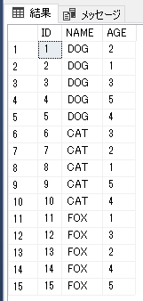
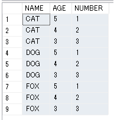

# SQLServer グループごとに上位３位までを表示する

## ROW_NUMBDR
結果セットの出力に番号（クエリ実行時の一時的な値）を設定して抽出

名前が同じで、年齢がバラバラの動物テーブルを例とする<br>


## Usage
```sql
SELECT *
    FROM (
        SELECT
            NAME,
            AGE,
            ROW_NUMBER() OVER (PARTITION BY NAME ORDER BY AGE DESC ) AS NUMBER
        FROM
            ZOO
    ) AS ZOO
WHERE
    NUMBER <= 3;
```

動物の名前ごとに、年齢順に上位３位が表示される<br>


## Reference
[ROW NUMBER](https://docs.microsoft.com/ja-jp/sql/t-sql/functions/row-number-transact-sql?view=sql-server-ver15:title)<br>
[ORDER BY](https://docs.microsoft.com/ja-jp/sql/t-sql/queries/select-order-by-clause-transact-sql?view=sql-server-ver15:title)<br>
