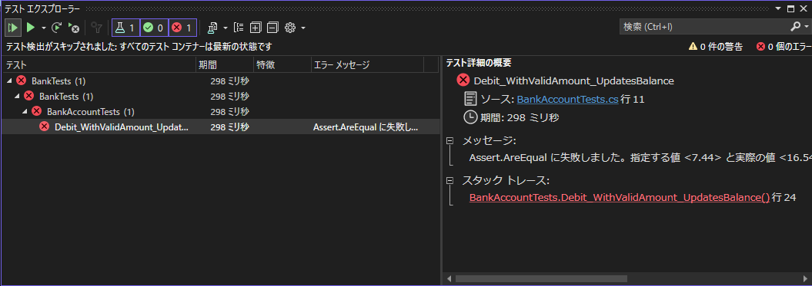
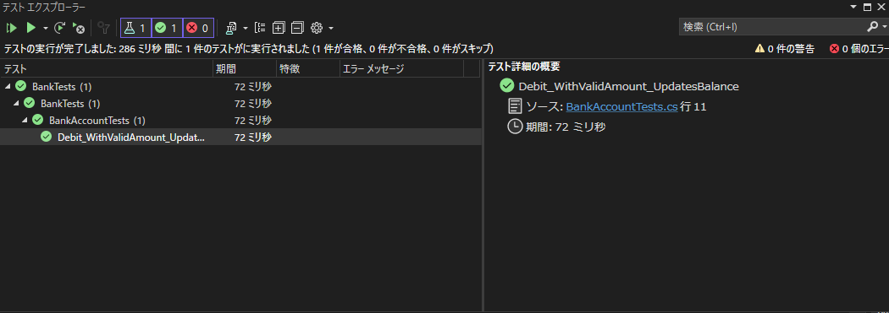
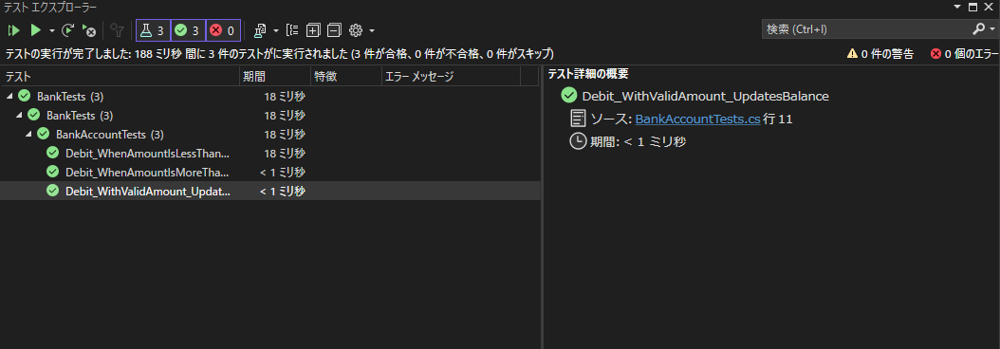

---
tags:
  - C#
  - ソフトウェアテスト
  - MSTest
---

# C# MSTest 自動テスト
- MSTestはMicrosoftが提供するテストフレームワーク
- 設定要らずでテストが書き始められるのが強み
- `.NET framework 4.5.2` 以前のversionで自動テストしたいときにも使いやすい

## プロジェクト作成手順
1. テストプロジェクト作成
2. 既存プロジェクト追加
3. 既存プロジェクトをテストプロジェクトの参照に追加
4. テストコード実装
5. テスト実行

## テストコード

- `[TestClass]`属性クラスの`[TestMethod]`属性メソッドがテスト実行される
- 属性がないとエラーにすらならないので注意

```C#
using Microsoft.VisualStudio.TestTools.UnitTesting;
using Prime.Services;

namespace Prime.UnitTests.Services
{
    [TestClass]
    public class PrimeService_IsPrimeShould
    {
        private readonly PrimeService _primeService;

        public PrimeService_IsPrimeShould()
        {
            _primeService = new PrimeService();
        }

        [TestMethod]
        public void IsPrime_InputIs1_ReturnFalse()
        {
            bool result = _primeService.IsPrime(1);

            Assert.IsFalse(result, "1 should not be prime");
        }
    }
}
```

## デモコード

公式の[チュートリアル](https://learn.microsoft.com/ja-jp/visualstudio/test/walkthrough-creating-and-running-unit-tests-for-managed-code?view=vs-2022)より`BankAccount.cs`

```cs title="BankAccount.cs"
using System;

namespace BankAccountNS
{
    /// <summary>
    /// Bank account demo class.
    /// </summary>
    public class BankAccount
    {
        private readonly string m_customerName;
        private double m_balance;

        private BankAccount() { }

        public BankAccount(string customerName, double balance)
        {
            m_customerName = customerName;
            m_balance = balance;
        }

        public string CustomerName
        {
            get { return m_customerName; }
        }

        public double Balance
        {
            get { return m_balance; }
        }

        public void Debit(double amount)
        {
            if (amount > m_balance)
            {
                throw new ArgumentOutOfRangeException("amount");
            }

            if (amount < 0)
            {
                throw new ArgumentOutOfRangeException("amount");
            }

            m_balance += amount; // intentionally incorrect code
        }

        public void Credit(double amount)
        {
            if (amount < 0)
            {
                throw new ArgumentOutOfRangeException("amount");
            }

            m_balance += amount;
        }

        public static void Main()
        {
            BankAccount ba = new BankAccount("Mr. Bryan Walton", 11.99);

            ba.Credit(5.77);
            ba.Debit(11.22);
            Console.WriteLine("Current balance is ${0}", ba.Balance);
        }
    }
}
```

`BankAccount.cs`の`Debit()`は、口座から現金が引き出されるときに呼び出される

`Debit()`の動作を検証する単体テストメソッドを記述する

確認する必要がある3つの動作

- 引き落とし金額が残高を上回る場合、`ArgumentOutOfRangeException` をスローする
- 引き落とし金額が 0 未満の場合、`ArgumentOutOfRangeException` をスローする
- 引き落とし金額が有効な場合、口座残高から借方金額を減算する

テストプロジェクトを作成し、Bankプロジェクトの参照を追加する

```cs title="BankAccountTests.cs"
using BankAccountNS;
using Microsoft.VisualStudio.TestTools.UnitTesting;

namespace BankTests
{
    [TestClass]
    public class BankAccountTests
    {
        [TestMethod]
        [Description("正しい金額 (口座残高未満かつ 0 を上回る金額) によって口座からお金が引き出されることを確認する")]
        public void Debit_WithValidAmount_UpdatesBalance()
        {
            // Arrange
            double beginningBalance = 11.99;
            double debitAmount = 4.55;
            double expected = 7.44;
            BankAccount account = new BankAccount("Mr. Bryan Walton", beginningBalance);

            // Act
            account.Debit(debitAmount);

            // Assert
            double actual = account.Balance;
            Assert.AreEqual(expected, actual, 0.001, "Account not debited correctly");
        }
    }
}
```

テストメソッドのAssertメソッドの構文は、下記の通り

```cs
// Assertメソッドの構文
Assert.AreEqual(expected, actual, message)

// expected: 期待値
// actual:   実際の値
// message:  アサーションが失敗した時のメッセージ
```

`BankAccountTests`を実行すると、テストが失敗する

```
Assert.AreEqual に失敗しました。指定する値 <7.44> と実際の値 <16.54> との間には <0.001> 以内の差が必要です。Account not debited correctly
```



テストメソッドの実行によって、`Debit()`で引き出された後は残高が減っているはずが、逆に残高が増えてしまっていることが分かった

バグを修正する

```cs title="BankAccount.cs"
// Before
m_balance += amount;

// After
m_balance -= amount;
```

バグを修正後にテストメソッドを再度実行すると、今度はテストが成功する



例外の発生をテストする

```cs
[TestMethod]
[Description("引き落とし金額が０未満の場合にArgumentOutOfRangeException をスローすることを確認する")]
public void Debit_WhenAmountIsLessThanZero_ShouldThrowArgumentOutOfRange()
{
    // Arrange
    double beginningBalance = 11.99;
    double debitAmount = -100.00;
    BankAccount account = new BankAccount("Mr. Bryan Walton", beginningBalance);

    // Act and assert
    Assert.ThrowsException<System.ArgumentOutOfRangeException>(() => account.Debit(debitAmount));
}

[TestMethod]
[Description("引き落とし金額が残高よりも大きい場合にArgumentOutOfRangeException をスローすることを確認する")]
public void Debit_WhenAmountIsMoreThanBalance_ShouldThrowArgumentOutOfRange()
{
　　 // Arrange
    double beginningBalance = 11.99;
    double debitAmount = 51.00;
    BankAccount account = new BankAccount("Mr. Bryan Walton", beginningBalance);

    // Act and assert
    Assert.ThrowsException<System.ArgumentOutOfRangeException>(() => account.Debit(debitAmount));
}
```
テストメソッドを実行して、テストの成功を確認する



テストメソッドのリファクタリング

意図したメソッドで例外が発生したかどうかをテストできるようにする

```cs
[TestMethod]
[Description("引き落とし金額が残高よりも大きい場合にArgumentOutOfRangeException をスローすることを確認する")]
public void Debit_WhenAmountIsMoreThanBalance_ShouldThrowArgumentOutOfRange()
{
    // Arrange
    double beginningBalance = 11.99;
    double debitAmount = 20.0;
    BankAccount account = new BankAccount("Mr. Bryan Walton", beginningBalance);

    // Act
    try
    {
        account.Debit(debitAmount);
    }
    catch (System.ArgumentOutOfRangeException e)
    {
        // Assert
        StringAssert.Contains(e.Message, BankAccount.DebitAmountExceedsBalanceMessage);
        return;
    }

    // 例外が発生しなかった場合、テストメソッドを失敗させる
    Assert.Fail("The expected exception was not thrown.");
}
```

## GitHub
- [ソースコード](https://github.com/pixcelo/exampleMSTest)

## Reference
- [チュートリアル: マネージド コードの単体テストを作成し、実行する](https://learn.microsoft.com/ja-jp/visualstudio/test/walkthrough-creating-and-running-unit-tests-for-managed-code?view=vs-2022)
- [MSTest と .NET による単体テスト C#](https://learn.microsoft.com/ja-jp/dotnet/core/testing/unit-testing-with-mstest)
- [.NET Core と .NET Standard での単体テストのベスト プラクティス](https://learn.microsoft.com/ja-jp/dotnet/core/testing/unit-testing-best-practices)
