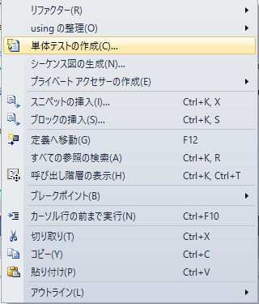

---
tags:
  - C#
  - ソフトウェアテスト
  - MSTest
---

# C# MSTest 具体的なケース別のテスト実装

`Assert`メソッドを使ってテストを行う際のサンプルを示す

## Usage

テストを作成するには、メソッドを右クリック -> 単体テストの作成を選択する



### `Assert`クラス

```cs
[TestMethod()]
public void TestEqualGetStringOne()
{
    // Arrange
    var expected = "1";

    // Act
    var actual = GetStringOne();

    // Assert
    Assert.AreEqual(expected, actual);
}
```

## Reference
- [単体テストに Assert クラスを使用する](https://learn.microsoft.com/ja-jp/visualstudio/test/using-the-assert-classes?view=vs-2022)
- [CollectionAssert Class](https://learn.microsoft.com/ja-jp/dotnet/api/microsoft.visualstudio.testtools.unittesting.collectionassert?view=visualstudiosdk-2022)
- [StringAssert Class](https://learn.microsoft.com/ja-jp/dotnet/api/microsoft.visualstudio.testtools.unittesting.stringassert?view=visualstudiosdk-2022)
- [単体テストの基本](https://learn.microsoft.com/ja-jp/visualstudio/test/unit-test-basics?source=recommendations&view=vs-2022)