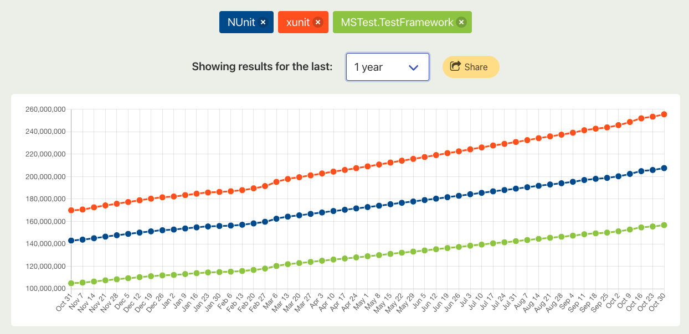

---
tags:
  - C#
  - テスト
---

# C# テストフレームワーク調査
ソフトウェアテストについて

## .NETのテストフレームワーク
主に3つのフレームワークが存在する
1. xUnit
- クロスプラットフォーム
- 一番人気

2. NUnit
- クロスプラットフォーム
- JUnit(Java)の流れを組む

3. MSTest
- visual studio必須
- 簡単に始められる

2022.11.5時点でのNuget Trends 

xUnitが一番良さそうな印象を受けた 

技術を選定する際は、たくさん使われているものを選んでおくのが無難である
  

理由は以下の通り
- 調べたときに情報が多い
- 移籍しても使える
- 技術が長持ちする

### webで調査した結果
- まっさらなプロジェクトに導入するならxUnit
- すでに他の言語でもテストを書いているならNUnitが書きやすい
- 設定などの面倒な作業を考えず、すぐに始められるのがMSTest

## Reference
[.NET でのテスト](https://learn.microsoft.com/ja-jp/dotnet/core/testing/) 
[xUnit](https://xunit.net/) 
[NUnit](https://nunit.org/) 
[MSTest](https://github.com/microsoft/testfx) 
