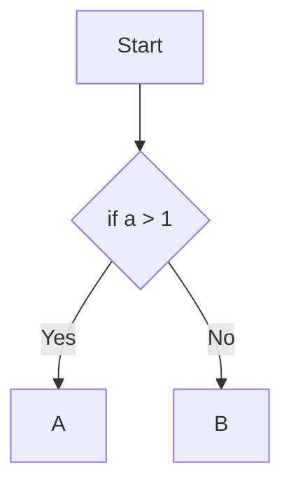

---
tags:
  - テスト
---

# ソフトウェアテストを学ぶ

「知識ゼロから学ぶソフトウェアテスト」

成果物の品質を上げたいと思い、テストについてまとめられた書籍を購入した

書籍を読んで、要約、自分が感じたこと等をまとめる

## テスト担当者の心得

`バグを全部見つけるのは無理だと心得ろ`

* ソフトウェアには無数のバグが潜在し、ゼロにするのは難しい
* 優先順位を設け、品質に致命的なバグを潰す

`エラーは見つからないだろうというい設定のもとにテストの計画を立ててはいけない`

* 車の運転と同じで、エラーはないだろうと思うとバグを見逃す
* 常にバグがあるかもしれないという姿勢でテストに臨むべし

`プログラムのある部分でエラーがまだ存在している確率は、すでにその部分で見つかったエラーの数に比例する`

* バグはプログラムの特定の部分に偏在している（バグの47%はプログラムの4%の部分に偏在しているという例）
* 複雑なプログラムの箇所でバグが見つかったらなら、まだ別のバグが残っているかもしれないと考えた方が良い

`ソフトウェアテストで重要なのは、どの部分にバグが出やすいのか、そこにどのような手法を適用すれば十分な品質が得られるかを知ることである`

## 完全無欠なソフトウェアテストは可能か？

* まったくバグのないソフトウェアは存在しない
* 「完璧」ではなくとも「十分」な品質を持つソフトウェアは効果的なテストで実現できる

`品質向上のための投資は、投資額が修正にかかる費用を超過するか、「もっとましなことをすべきだ」と誰かが言い出すまで増加しつづける`

`テストケースを書くことはプログラムを書くよりも難しい`

## ホワイトボックステスト

* 「どのテスト手法を適用すべきなのか」を常によく考える
* 限りある時間の中で効率的にテストを実行する

`ホワイトボックステストは論理構造の正しさのみをテストするため、ソフトウェアの仕様が間違っていることから起こるバグは発見できない`

### 制御パステスト法

* プログラムがどのような振る舞いをして、どのように制御され実行されていくかをテストする
* 制御パステストによるコードカバレッジテストの本質は、様々に分岐するフローチャートをきちんとカバーすることにある

`ステートメントカバレッジ`

ステートメントカバレッジは、コード内の命令文（ステートメント）を少なくとも一回は実行する

ステートメントカバレッジでは、`a > 1`が`true`となるケースを1回実行することでテストを終了するため、`a == 0`などのパスが抜ける非常に弱いテスト手法

また、そもそも`if a > 1`の部分を`if a > 0`と書いてしまった場合のバグは発見できない

`ブランチカバレッジ`

ブランチカバレッジは、分岐コードに対して`true`と`false`の結果を少なくとも一回ずつ持つようにテストケースを実行する

* テストケースの数が増大する
* ある特定のバグが発生しやすい部分にブランチカバレッジを実行するのが効果的
