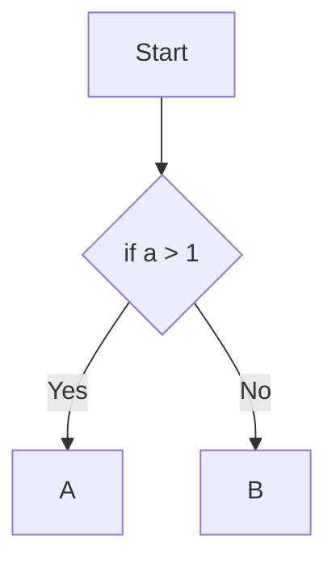

---
tags:
  - テスト
---

# ソフトウェアテストを学ぶ

「知識ゼロから学ぶソフトウェアテスト」

成果物の品質を上げたいと思い、テストについてまとめられた書籍を購入した

書籍を読んで、要約、自分が感じたこと等をまとめる

## テスト担当者の心得

`バグを全部見つけるのは無理だと心得ろ`

* ソフトウェアには無数のバグが潜在し、ゼロにするのは難しい
* 優先順位を設け、品質に致命的なバグを潰す

`エラーは見つからないだろうという設定のもとにテストの計画を立ててはいけない`

* 車の運転と同じで、エラーはないだろうと思うとバグを見逃す
* 常にバグがあるかもしれないという姿勢でテストに臨むべし

`プログラムのある部分でエラーがまだ存在している確率は、すでにその部分で見つかったエラーの数に比例する`

* バグはプログラムの特定の部分に偏在している（バグの47%はプログラムの4%の部分に偏在しているという例）
* 複雑なプログラムの箇所でバグが見つかったらなら、まだ別のバグが残っているかもしれないと考えた方が良い

`ソフトウェアテストで重要なのは、どの部分にバグが出やすいのか、そこにどのような手法を適用すれば十分な品質が得られるかを知ることである`

## 完全無欠なソフトウェアテストは可能か？

* まったくバグのないソフトウェアは存在しない
* 「完璧」ではなくとも「十分」な品質を持つソフトウェアは効果的なテストで実現できる

`品質向上のための投資は、投資額が修正にかかる費用を超過するか、「もっとましなことをすべきだ」と誰かが言い出すまで増加しつづける`

`テストケースを書くことはプログラムを書くよりも難しい`

## ホワイトボックステスト

* 「どのテスト手法を適用すべきなのか」を常によく考える
* 限りある時間の中で効率的にテストを実行する

`ホワイトボックステストは論理構造の正しさのみをテストするため、ソフトウェアの仕様が間違っていることから起こるバグは発見できない`

### 制御パステスト法

* プログラムがどのような振る舞いをして、どのように制御され実行されていくかをテストする
* 制御パステストによるコードカバレッジテストの本質は、様々に分岐するフローチャートをきちんとカバーすることにある

`ステートメントカバレッジ`

ステートメントカバレッジは、コード内の命令文（ステートメント）を少なくとも一回は実行する

ステートメントカバレッジでは、`a > 1`が`true`となるケースを1回実行することでテストを終了するため、`a == 0`などのパスが抜ける非常に弱いテスト手法

また、そもそも`if a > 1`の部分を`if a > 0`と書いてしまった場合のバグは発見できない



`ブランチカバレッジ`

ブランチカバレッジは、分岐コードに対して`true`と`false`の結果を少なくとも一回ずつ持つようにテストケースを実行する

* テストケースの数が増大する
* ある特定のバグが発生しやすい部分にブランチカバレッジを実行するのが効果的

### カバレッジ基準

カバレッジ基準とは、テストがどれだけ網羅されているかを示す基準値

* 一般の商用ソフトウェアなら60~90%程度で十分
* カバレッジ測定せずに出荷するのはリスクの高い行為
* カバレッジの値が高いから絶対に大丈夫とは言えない

Visual Studioにもコードカバレッジ分析の機能はあるが`Visual Studio Enterprise`に限定されている

nugetで提供されているC#用の分析ツール

* [Coverlet](https://www.nuget.org/packages/coverlet.console) カバレッジ測定ツール
* [ReportGenerator](https://www.nuget.org/packages/ReportGenerator) レポート出力ツール

カバレッジテストで検出できないバグ

* プログラムのループに関するバグ
* 要求仕様自体が間違っていたり、機能が備わっていないバグ
* データに起因するバグ
* タイミングに起因するバグ

プログラムのループに関するテストケース

* ループをしない、ループ自体がスキップされるケース
* ループ回数が1回のケース
* 典型的なループ回数のケース
* 最大ループ回数より1少ない数でのケース
* 最大ループ回数でのケース
* 最大ループ回数 + 1でのケース

要求仕様自体が間違っていたり、機能が備わっていないバグ

* 仕様自体が間違っていても、テストでバグを検出できない
* 機能自体がごっそり抜け落ちていても検出できないので、要求仕様書をテスト仕様書と付き合わせてチェックする必要がある

データに起因するバグ

* `mutex`等、複数のプログラム（タスク）が同時に処理を行う環境（並列処理）で、共有資源に対して同時にアクセスしても問題がないようにする
* データベースの中身が変化することでバグが出たり、出なかったりするケース

タイミング（マルチタスクや割り込み）に起因するバグ

* データがプロセス・スレッド間で共有されているかをチェックする
* 共有されているデータへのアクセスパターンをテストケースに落とし込む
* プロセス・スレッドの生成と削減の組み合わせをテストする
* できるだけたくさんのプロセスとスレッドを立ち上げてテストする

## テスト駆動開発

`Test Driven Development (TDD)`

* まず失敗するテストを書いて、その後にテストが通るようにコードを実装する
* 開発スピードが向上し、変更に耐性を持たせることができる
* リファクタリングや仕様変更の際に、修正の影響範囲がわかりやすい

## ブラックボックステスト

ブラックボックスはプログラムを一種のブラックボックスと見立て、ソースコードを見ずにテストを行う手法

「ソフトウェアは4つの仕事しかしない。その4つの振る舞いをテストすれば良い」

* 入力を処理する
* 出力を処理する
* 計算を行う
* データを保存する

入力と出力のテストする「同値分割法」と「境界値分析法」

### 同値分割法

* 入力領域を「同値クラス」という部分集合に分割
* 部分集合に入る入力値を等価とみなす

```cs
// a は 1~999 まで入力可能とする
if (0 < a && a <= 999)
{
    // 正しい値のときの処理
}
else
{
    // 間違った値のときの処理
}
```

上記の例の場合は、入力値を2つの部分集合（無効同値と有効同値）に分けることができる

```c
[ 無効同値(~0) ] [ 有効同値(1~999) ] [ 無効同値(1000~) ]
```
テストケースには、この2つの部分集合を網羅するように用意する

```c
a = -10   // 無効同値
a = 0     // 無効同値
a = 500   // 有効同値
a = 999   // 有効同値
a = 1000  // 無効同値
```

### 境界値分析法

* プログラムで「境界」と呼ばれる場所には常にバグが潜んでいる
* 境界値近くは詳しくテストをする必要がある無効同値

境界値のバグパターン
```cs
// [正常]
if (0 < a) { }

// [異常] 0 <= a としてしまう
if (0 <= a) { }

// [異常] 1 < a としてしまう
if (1 < a) { }

// [異常] 余分な境界を加えてしまう
if (1 < a && a < 10) { }
```

### On-Offポイント法

* 境界値をテストする一般的な方法
* 異なる処理が行われる一番近い点をテストケースとする

上記の例だと、「0」と「1」が異なる処理の境界となる

## ディシジョンテーブル

* すべての入力の組み合わせを表にして、入力に対する動作もしくは出力を明記する
* 表に状態やルール、動作などをまとめる
* テストケースの抜けを発見しやすい
* 項目数が少なく、複雑な処理をするプログラムに効果的

|     |      | 1 | 2 | 3 | 4 |
| -- | -- | -- | -- | -- | -- |
|     | 10未満  | Y | N | N | Y |
| 条件 | 10~30 | N | Y | N | N |
|     | 30以上  | N | N | Y | N |
| 動作 | 正常出力 |  |  |  | x |
|     |　エラー処理  |  | x | x | x |

## GUIのテスト

状態遷移テスト
* 状態`state`と遷移`transition`の2つで表現される
* 入力`X`によって状態が`A->B`と遷移するテスト


## Reference
* [単体テストにコードカバレッジを使用する](https://learn.microsoft.com/ja-jp/dotnet/core/testing/unit-testing-code-coverage?tabs=linux)
* [coverlet.console](https://www.nuget.org/packages/coverlet.console)
* [ReportGenerator](https://www.nuget.org/packages/ReportGenerator)
