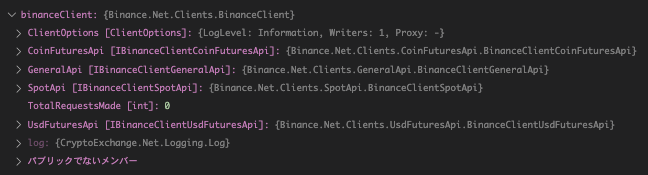

---
tags:
  - C#
---

# C# CryptoExchange.Netライブラリで仮想通貨を自動売買する

nugetで公開されている`CryptoExchange.Net`の使い方をまとめる

`CryptoExchange.Net`をベースとした`Binance.Net`を使ってAPI通信を行うことをゴールとする

APIキーは[Binance API Management](https://www.binance.com/en/my/settings/api-management)の管理画面から取得しておく

## Usage
nugetからインストール
```
dotnet add package Binance.Net --version 8.3.0
```

REST APIクライアントのインスタンスを作成
```cs
var binanceClient = new BinanceClient(new BinanceClientOptions()
{
    ApiCredentials = new ApiCredentials("API-KEY", "API-SECRET"),
    SpotApiOptions = new BinanceApiClientOptions
    {
        RateLimitingBehaviour = RateLimitingBehaviour.Fail
    },
    UsdFuturesApiOptions = new BinanceApiClientOptions
    {
        ApiCredentials = new ApiCredentials("OTHER-API-KEY-FOR-FUTURES", "OTHER-API-SECRET-FOR-FUTURES")
    }
});
```
クライアントのインスタンスから、保持するエンドポイントやオプションを確認できる




市場データを入手する

```cs
// 通貨データを取得
var callResult = await binanceClient.SpotApi.ExchangeData.GetExchangeInfoAsync();
if(!callResult.Success)
{
    Console.WriteLine("Request failed: " + callResult.Error);
    return;
}

var symbols = callResult.Data.Symbols;

foreach (var symbol in symbols)
{
    Console.WriteLine(symbol.Name); // ETHBTC
}
```

```cs
// 通貨の価格データを取得
var spotTickerData = await binanceClient.SpotApi.ExchangeData.GetTickersAsync();
if(!spotTickerData.Success)
{
    Console.WriteLine("Request failed: " + spotTickerData.Error);
    return;
}

var tickers = spotTickerData.Data;

foreach (var ticker in tickers)
{
    Console.WriteLine(ticker.Symbol);    // ETHBTC
    Console.WriteLine(ticker.LastPrice); // 0.07365800
}
```

```cs
// 板情報を取得
var spotOrderBookData = await binanceClient.SpotApi.ExchangeData.GetOrderBookAsync("BTCUSDT");
if(!spotOrderBookData.Success)
{
    Console.WriteLine("Request failed: " + spotOrderBookData.Error);
    return;
}

var orderBook = spotOrderBookData.Data;
Console.WriteLine(orderBook.Symbol); // BTCUSDT

foreach (var bid in orderBook.Bids)
{
    Console.WriteLine(bid.Price);    // 17419.66000000
    Console.WriteLine(bid.Quantity); // 0.20466000
}
```

```cs
// ヒストリカルデータ取得
var spotTradeHistoryData = await binanceClient.SpotApi.ExchangeData.GetTradeHistoryAsync("BTCUSDT");
if(!spotTradeHistoryData.Success)
{
    Console.WriteLine("Request failed: " + spotTradeHistoryData.Error);
    return;
}

var spotTradeHistory = spotTradeHistoryData.Data;

foreach (var item in spotTradeHistory)
{
    Console.WriteLine(item.OrderId);      // 2336973335
    Console.WriteLine(item.BaseQuantity); // 0.00070000
    Console.WriteLine(item.BuyerIsMaker); // True
    Console.WriteLine(item.IsBestMatch);  // True
    Console.WriteLine(item.Price);        // 17431.47000000
    Console.WriteLine(item.TradeTime);    // 2022/12/15 19:36:46
}
```

`CryptoExchange.Net`の[Document](https://jkorf.github.io/CryptoExchange.Net/Clients.html#processing-request-responses)にあるように、API通信のレスポンスは``

## Reference
* [Binance.Net nuget](https://www.nuget.org/packages/Binance.Net)
* [Binance.Net github](https://github.com/JKorf/Binance.Net)
* [Binance.Net Document](https://jkorf.github.io/Binance.Net/)
* [CryptoExchange.Net Document](https://jkorf.github.io/CryptoExchange.Net/)
