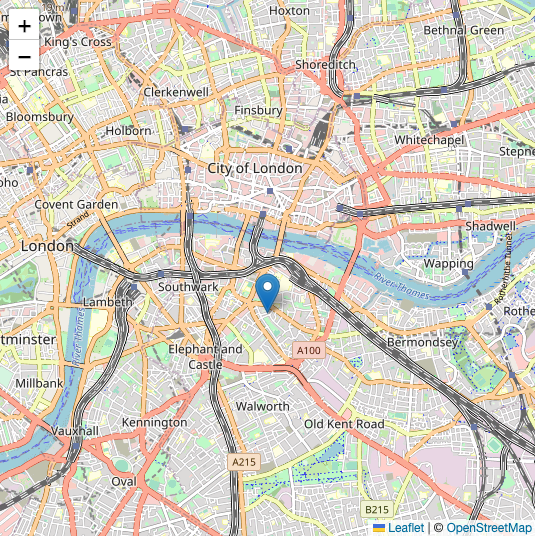

# Leaflet.js でマーカーを表示する
Leaflet.jsを使った地図とマーカー表示まで

## Leaflet とは
https://leafletjs.com/

Leaflet は地図を簡単に扱えるJavaScirptライブラリ

## Usage
ダウンロード、またはCDNで読み込む
```
<link rel="stylesheet" href="https://unpkg.com/leaflet@1.9.2/dist/leaflet.css" integrity="sha256-sA+zWATbFveLLNqWO2gtiw3HL/lh1giY/Inf1BJ0z14=" crossorigin="" />
<script src="https://unpkg.com/leaflet@1.9.2/dist/leaflet.js" integrity="sha256-o9N1jGDZrf5tS+Ft4gbIK7mYMipq9lqpVJ91xHSyKhg=" crossorigin=""></script>
```
npmでもインストールできる
https://www.npmjs.com/package/leaflet

## 地図の表示
地図を表示する手順
1. `<div id="map"></div>`に対して`map`を定義
2. レイヤーを地図に追加

```html
<link rel="stylesheet" href="../leaflet/leaflet.css" />
<script src="../leaflet/leaflet.js"></script>
</head>
<body>
    <div id="map"></div>
</body>
<script>
    // 地図の設定
    const map = L.map('map').setView([51.505, -0.09], 13);

    // タイルレイヤーの設定
    L.tileLayer('https://tile.openstreetmap.org/{z}/{x}/{y}.png', {
        maxZoom: 19,
        attribution: '&copy; <a href="http://www.openstreetmap.org/copyright">OpenStreetMap</a>'
    }).addTo(map);
</script
```

マーカーを追加する場合もレイヤーと同様に`addTo(map)`を使う
```javascript
// マーカー追加
const marker = L.marker([51.5, -0.09]).addTo(map);
```

<body>
    <div id="map"></div>
</body>
<script>
    const map = L.map('map').setView([51.505, -0.09], 13);

    L.tileLayer('https://tile.openstreetmap.org/{z}/{x}/{y}.png', {
        maxZoom: 19,
        attribution: '&copy; <a href="http://www.openstreetmap.org/copyright">OpenStreetMap</a>'
    }).addTo(map);

    const marker = L.marker([51.5, -0.09]).addTo(map);
</script>

<br/>

## ソースコード

https://github.com/pixcelo/Leaflet/blob/main/001/index.html
