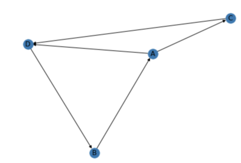
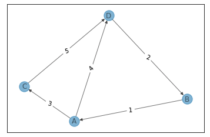

# networkx
networkxはネットワーク分析に用いるpython用ライブラリ

## 公式ページ
[networkx.org](https://networkx.org/)

## インストール
    pip3 install networkx
※ python3にインストールする場合

## ネットワーク分析の用語
* node（頂点）
* edge（辺）
* graph（グラフ=ネットワークのこと）
* degree（頂点の持つ辺の数）

## ネットワークを可視化する
    import networkx as nx
    G  = nx.Graph()

    # 頂点を追加
    G.add_nodes_from(["A", "B", "C", "D"])

    # 辺を追加
    G.add_edges_from([("A", "C"), ("C", "D"), ("D", "B"),("B", "A"), ("A", "D")])

    # グラフを描画する
    nx.draw(G, with_labels = True)

## ネットワークの情報を取得
    print(nx.info(G))

    > Graph with 4 nodes and 5 edges
グラフの詳細情報を取得できる

## 有向グラフを描画する
    DG = nx.DiGraph()

    DG.add_nodes_from(["A", "B", "C", "D"])
    DG.add_edges_from([("A", "C"), ("C", "D"), ("D", "B"),("B", "A"), ("A", "D")])

    nx.draw(DG, with_labels = True)
`DiGraph()`で有向グラフを扱うこともできる 

## 有向グラフに重みを付与する
    import networkx as nx
    DG = nx.DiGraph()

    DG.add_nodes_from(["A", "B", "C", "D"])
    DG.add_weighted_edges_from([("A", "C", 3), ("C", "D", 5), ("D", "B", 2),("B", "A", 1), ("A", "D", 4)])

    # ポジションのレイアウト設定
    pos = nx.spring_layout(DG, k=0.5)

    # グラフの描画
    nx.draw_networkx_edge_labels(G,pos, edge_labels=edge_labels)
    nx.draw_networkx(DG, pos, with_labels=True, alpha=0.5)

ノードに`(頂点1, 頂点2, 重み)`を渡すことで重みつき有向グラフを描画できる 

## 最短経路を求める
    print(nx.shortest_path(DG, source="A", target="D"))

    > ['A', 'D']
グラフ内の最短経路を計算するためのメソッド [shortest_path](https://networkx.org/documentation/stable/reference/algorithms/generated/networkx.algorithms.shortest_paths.generic.shortest_path.html#networkx.algorithms.shortest_paths.generic.shortest_path) が用意されている 
`shortest_path（G, source=None, target=None, weight=None, method='dijkstra'）` 
オプションにて探索アルゴリズムを選択できる `method='bellman-ford'` 
デフォルトはダイクストラ法になる
