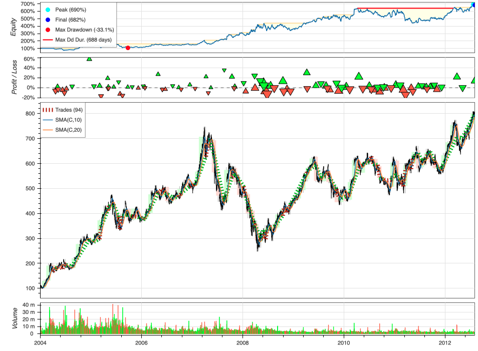

# Pythonライブラリ Backtesting.py
Pythonで米国株の相関係数を求める方法をまとめる

## Backtesting.py
Pythonのバックテスト用ライブラリ

## 公式ページ
[Backtesting.py](https://kernc.github.io/backtesting.py/)

## インストール
    pip3 install backtesting
` Backtesting.py`はPython3で動作する

## 使い方
    from backtesting import Backtest, Strategy
    from backtesting.lib import crossover

    from backtesting.test import SMA, GOOG

    class SmaCross(Strategy):
        def init(self):
            price = self.data.Close
            self.ma1 = self.I(SMA, price, 10)
            self.ma2 = self.I(SMA, price, 20)

        def next(self):
            if crossover(self.ma1, self.ma2):
                self.buy()
            elif crossover(self.ma2, self.ma1):
                self.sell()

    bt = Backtest(GOOG, SmaCross, commission=.002,
                exclusive_orders=True)
    stats = bt.run()
    stats

`BackTest(DataFrame(pandas), Strategyクラス, 手数料)` 
引数に渡すデータフレームのカラムは頭文字が大文字'Open', 'High', 'Low', 'Close'にする
注文は現在のローソク足の終値（または次のローソク足の始値）で計算される 
`run()`はバックテストのシミュレーション結果をpandasのseries型で返す

    Start                     2004-08-19 00:00:00
    End                       2013-03-01 00:00:00
    Duration                   3116 days 00:00:00
    Exposure Time [%]                   97.067039
    Equity Final [$]                  68221.96986
    Equity Peak [$]                   68991.21986
    Return [%]                         582.219699
    Buy & Hold Return [%]              703.458242
    Return (Ann.) [%]                   25.266427
    Volatility (Ann.) [%]               38.383008
    Sharpe Ratio                         0.658271
    Sortino Ratio                        1.288779
    Calmar Ratio                         0.763748
    Max. Drawdown [%]                  -33.082172
    Avg. Drawdown [%]                   -5.581506
    Max. Drawdown Duration      688 days 00:00:00
    Avg. Drawdown Duration       41 days 00:00:00
    # Trades                                   94
    Win Rate [%]                        54.255319
    Best Trade [%]                       57.11931
    Worst Trade [%]                    -16.629898
    Avg. Trade [%]                       2.074326
    Max. Trade Duration         121 days 00:00:00
    Avg. Trade Duration          33 days 00:00:00
    Profit Factor                        2.190805
    Expectancy [%]                       2.606294
    SQN                                  1.990216
    _strategy                            SmaCross
    _equity_curve                             ...
    _trades                       Size  EntryB...
    dtype: object

## バックテストを可視化する
    bt.plot()

ズームや詳細のポップアップなど動的なグラフをプロットできる

## 参考
Sugano様の[Mediumの記事](https://yuyasugano.medium.com/backtesting-py%E3%82%92%E3%81%AF%E3%81%98%E3%82%81%E3%81%8B%E3%82%89-backtesting-0-1-7-7b7aa2c662df)が詳細にまとめられていて参考になる
