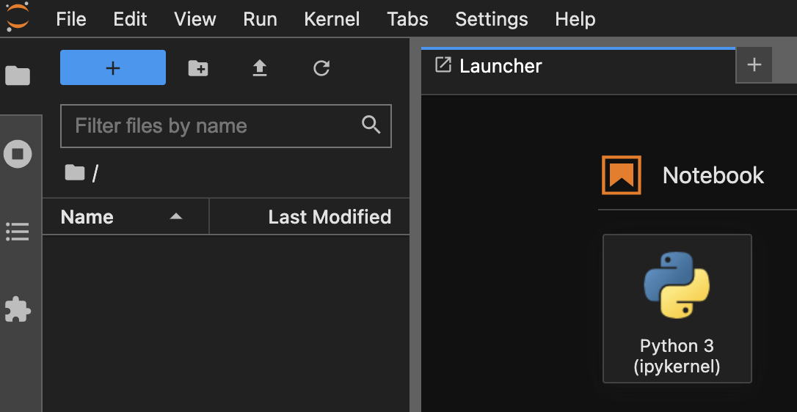
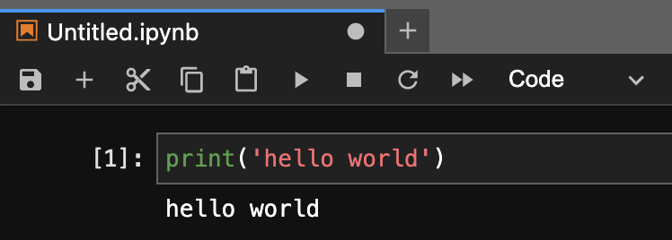

---
tags:
  - Python
---

# Python JupyterLabの使い方

- `JupyerLab`は、`Jupyter notebook`の後継機
- webベースでインタラクティブな開発ができる

## Install
`pip`でインストール
```
pip install jupyterlab
```

## Usage
ターミナルで`jupyter lab`を実行すると、ブラウザの新しいタブで`jupyterlab`が起動する
```
jupyter lab
```

`Python3`をクリックすると、新しいファイルが作成される



コードを入力し、`shift + Enter`でコードブロックを実行する



`jupyterlab`を終了するには、`ctr + c`で`Shutdown this Jupyter server (y/[n])?`とメッセージが表示された後に`y`を選択する

## Reference
- [Jupyter](https://jupyter.org/)
- [Jupyter Project Documentation](https://docs.jupyter.org/en/latest/)